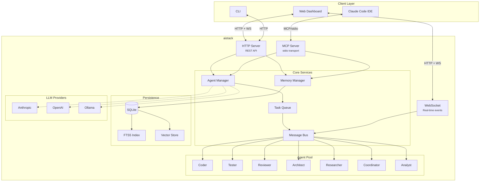
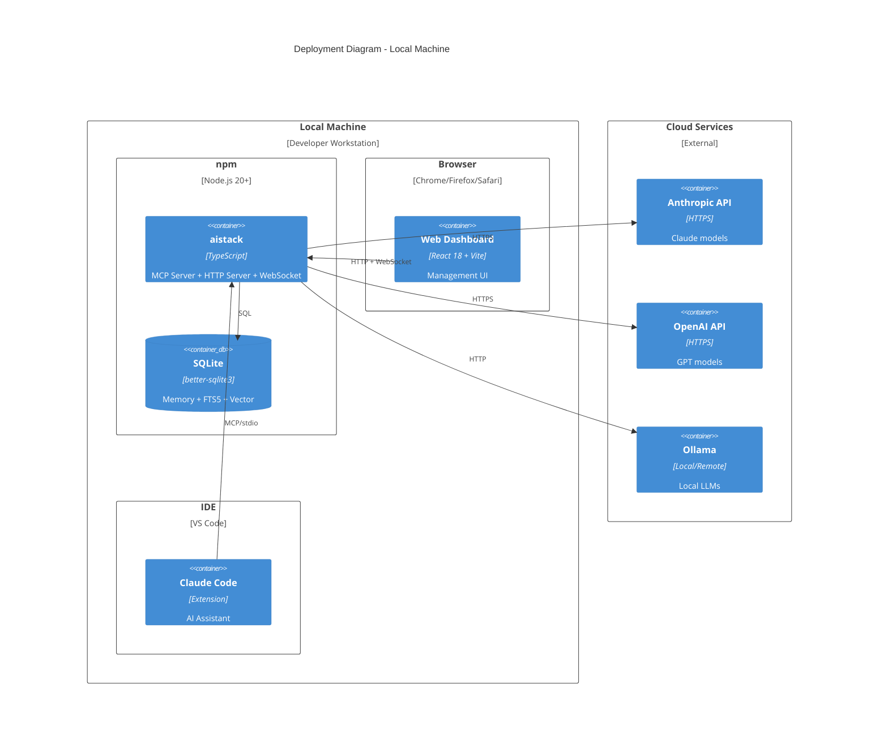
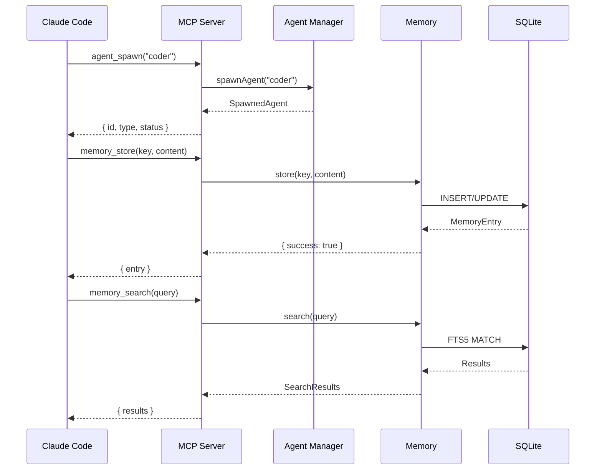
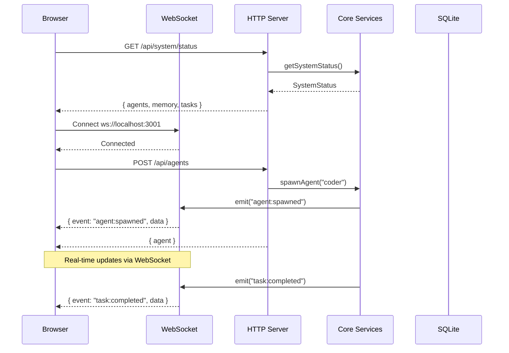

<div align="center">

# aistack

### Multi-Agent Orchestration for Claude Code

[](https://github.com/blackms/aistack/stargazers)
[](https://github.com/blackms/aistack/actions/workflows/ci.yml)
[](https://codecov.io/gh/blackms/aistack)
[](https://www.npmjs.com/package/@blackms/aistack)
[](https://www.npmjs.com/package/@blackms/aistack)
[](LICENSE)

<br/>

**Production-ready agent orchestration with persistent memory, MCP integration, and real-time web dashboard.**

<br/>

[Get Started](#-quick-start) · [Architecture](#-architecture) · [Web Dashboard](#-web-dashboard) · [API Reference](#-mcp-tools) · [Documentation](./docs)

<br/>

</div>

---

## Why aistack?

Coordinate specialized AI agents through Claude Code with persistent context, hierarchical task management, and seamless extensibility.

```
7 agents · 30 MCP tools · 6 LLM providers · SQLite + FTS5 · Web dashboard · Plugin system
```

---

## Tech Stack

<table>
<tr>
<td align="center" width="96">

<br/>Node.js 20+
</td>
<td align="center" width="96">

<br/>TypeScript
</td>
<td align="center" width="96">

<br/>SQLite + FTS5
</td>
<td align="center" width="96">

<br/>React 18
</td>
</tr>
<tr>
<td align="center" width="96">

<br/>Anthropic
</td>
<td align="center" width="96">

<br/>OpenAI
</td>
<td align="center" width="96">

<br/>Ollama
</td>
<td align="center" width="96">

<br/>Vite
</td>
</tr>
</table>

---

## Features

| Feature | Description |
|---------|-------------|
| **Specialized Agents** | 7 built-in agent types: coder, researcher, tester, reviewer, architect, coordinator, analyst |
| **Persistent Memory** | SQLite with FTS5 full-text search and optional vector embeddings |
| **MCP Integration** | 30 tools exposed via Model Context Protocol for Claude Code |
| **Web Dashboard** | Real-time dashboard with 9 pages for visual management and monitoring |
| **REST API + WebSocket** | 50+ HTTP endpoints with live WebSocket event streaming |
| **Hierarchical Coordination** | Task queue, message bus, and coordinator pattern |
| **Multi-Provider Support** | 3 API providers (Anthropic, OpenAI, Ollama) + 3 CLI providers (Claude, Gemini, Codex) |
| **Plugin System** | Runtime extensibility for agents, tools, hooks, and providers |
| **Workflow Engine** | Multi-phase workflows with adversarial validation |

---

## Quick Start

### Installation

```bash
npm install @blackms/aistack
```

### Initialize & Connect

```bash
# Initialize project
npx @blackms/aistack init

# Add to Claude Code
claude mcp add aistack -- npx @blackms/aistack mcp start

# Verify installation
npx @blackms/aistack status
```

### Start Web Dashboard

```bash
# Start backend + web dashboard
npx @blackms/aistack web start

# Open http://localhost:3001
```

### Configuration

Create `aistack.config.json`:

```json
{
  "version": "1.0.0",
  "providers": {
    "default": "anthropic",
    "anthropic": { "apiKey": "${ANTHROPIC_API_KEY}" }
  },
  "memory": {
    "path": "./data/aistack.db",
    "vectorSearch": { "enabled": false }
  }
}
```

---

## Architecture



### Deployment Overview



### Request Flow



---

## Web Dashboard

The built-in web dashboard provides visual management and real-time monitoring of your agent orchestration.

### Starting the Dashboard

```bash
# Start the web server (includes dashboard)
npx @blackms/aistack web start

# Open in browser
open http://localhost:3001
```

### Dashboard Pages

| Page | Description |
|------|-------------|
| **Dashboard** | System overview with agent status, memory stats, and recent activity |
| **Agents** | Spawn, monitor, and manage agents in real-time |
| **Memory** | Browse, search, and manage memory entries with FTS5 |
| **Tasks** | View task queue, status, and completion history |
| **Projects** | Project management with task workflows |
| **Project Detail** | Deep dive into project tasks and specifications |
| **Task Detail** | Task lifecycle with phase transitions |
| **Workflows** | Define and run multi-phase workflows |
| **Chat** | Interactive agent chat interface |

### Web Dashboard Flow



---

## Agents

<table>
<tr>
<th>Agent</th>
<th>Purpose</th>
<th>Capabilities</th>
</tr>
<tr>
<td><b>coder</b></td>
<td>Write and modify code</td>
<td><code>write-code</code> <code>edit-code</code> <code>refactor</code> <code>debug</code> <code>implement-features</code></td>
</tr>
<tr>
<td><b>researcher</b></td>
<td>Gather information</td>
<td><code>search-code</code> <code>read-documentation</code> <code>analyze-patterns</code> <code>gather-requirements</code> <code>explore-codebase</code></td>
</tr>
<tr>
<td><b>tester</b></td>
<td>Test and validate</td>
<td><code>write-tests</code> <code>run-tests</code> <code>identify-edge-cases</code> <code>coverage-analysis</code> <code>test-debugging</code></td>
</tr>
<tr>
<td><b>reviewer</b></td>
<td>Quality assurance</td>
<td><code>code-review</code> <code>security-review</code> <code>performance-review</code> <code>best-practices</code> <code>feedback</code></td>
</tr>
<tr>
<td><b>architect</b></td>
<td>System design</td>
<td><code>system-design</code> <code>technical-decisions</code> <code>architecture-review</code> <code>documentation</code> <code>trade-off-analysis</code></td>
</tr>
<tr>
<td><b>coordinator</b></td>
<td>Orchestrate work</td>
<td><code>task-decomposition</code> <code>agent-coordination</code> <code>progress-tracking</code> <code>result-synthesis</code> <code>workflow-management</code></td>
</tr>
<tr>
<td><b>analyst</b></td>
<td>Data insights</td>
<td><code>data-analysis</code> <code>performance-profiling</code> <code>metrics-collection</code> <code>trend-analysis</code> <code>reporting</code></td>
</tr>
</table>

---

## MCP Tools

### Agent Tools (6)
```
agent_spawn          agent_list           agent_stop
agent_status         agent_types          agent_update_status
```

### Memory Tools (5)
```
memory_store         memory_search        memory_get
memory_list          memory_delete
```

### Task Tools (5)
```
task_create          task_assign          task_complete
task_list            task_get
```

### Session Tools (4)
```
session_start        session_end          session_status
session_active
```

### System Tools (3)
```
system_status        system_health        system_config
```

### GitHub Tools (7)
```
github_issue_create  github_issue_list    github_issue_get
github_pr_create     github_pr_list       github_pr_get
github_repo_info
```

---

## Programmatic API

```typescript
import {
  spawnAgent,
  getMemoryManager,
  startMCPServer,
  getConfig,
} from '@blackms/aistack';

// Spawn an agent
const agent = spawnAgent('coder', { name: 'my-coder' });

// Use memory with search
const memory = getMemoryManager(getConfig());
await memory.store('pattern', 'Use dependency injection', {
  namespace: 'architecture'
});
const results = await memory.search('injection');

// Start MCP server
const server = await startMCPServer(getConfig());
```

### Submodule Imports

```typescript
import { MemoryManager } from '@blackms/aistack/memory';
import { spawnAgent, listAgentTypes } from '@blackms/aistack/agents';
import { startMCPServer } from '@blackms/aistack/mcp';
```

---

## Plugin System

Extend aistack with custom agents, tools, and hooks:

```typescript
import type { AgentStackPlugin } from '@blackms/aistack';

export default {
  name: 'my-plugin',
  version: '1.0.0',

  agents: [{
    type: 'custom-agent',
    name: 'Custom Agent',
    description: 'Specialized behavior',
    systemPrompt: 'You are a custom agent...',
    capabilities: ['custom-task'],
  }],

  tools: [{
    name: 'custom_tool',
    description: 'A custom MCP tool',
    inputSchema: { type: 'object', properties: { input: { type: 'string' } } },
    handler: async (params) => ({ result: 'done' })
  }],

  async init(config) { /* setup */ },
  async cleanup() { /* teardown */ }
} satisfies AgentStackPlugin;
```

---

## CLI Reference

| Command | Description |
|---------|-------------|
| `init` | Initialize project structure |
| `agent spawn -t <type>` | Spawn agent |
| `agent list` | List active agents |
| `agent stop -n <name>` | Stop agent |
| `agent types` | Show available types |
| `agent status -n <name>` | Get agent status |
| `agent run -t <type> -p <prompt>` | Spawn and execute task |
| `agent exec -n <name> -p <prompt>` | Execute task with existing agent |
| `memory store -k <key> -c <content>` | Store entry |
| `memory search -q <query>` | Search memory |
| `memory list` | List entries |
| `memory delete -k <key>` | Delete entry |
| `mcp start` | Start MCP server |
| `mcp tools` | List MCP tools |
| `web start` | Start web dashboard server |
| `workflow run <name>` | Run workflow |
| `workflow list` | List workflows |
| `status` | System status |

---

## LLM Providers

### API Providers
| Provider | Default Model | Embeddings |
|----------|---------------|------------|
| **Anthropic** | claude-sonnet-4-20250514 | - |
| **OpenAI** | gpt-4o | text-embedding-3-small |
| **Ollama** | llama3.2 | nomic-embed-text |

### CLI Providers
| Provider | CLI Tool | Default Model |
|----------|----------|---------------|
| **Claude Code** | `claude` | sonnet |
| **Gemini CLI** | `gemini` | gemini-2.0-flash |
| **Codex** | `codex` | - |

CLI providers enable agent execution through external CLI tools, useful for interactive workflows.

---

## Project Structure

```
src/
├── agents/         # Agent registry, spawner, definitions (7 types)
├── cli/            # CLI commands
├── coordination/   # Task queue, message bus, topology
├── github/         # GitHub integration
├── hooks/          # Lifecycle hooks
├── mcp/            # MCP server and 30 tools
├── memory/         # SQLite, FTS5, vector search
├── plugins/        # Plugin loader and registry
├── providers/      # LLM provider implementations (6 providers)
├── web/            # REST API routes + WebSocket
├── workflows/      # Workflow engine
└── utils/          # Config, logger, validation

web/
├── src/
│   ├── pages/      # 9 dashboard pages
│   ├── components/ # React components
│   ├── hooks/      # Custom React hooks
│   └── stores/     # Zustand state management
└── public/         # Static assets
```

---

## Development

```bash
npm install          # Install dependencies
npm run build        # Build
npm test             # Run tests
npm run test:coverage # With coverage
npm run typecheck    # Type check
npm run lint         # Lint

# Web dashboard development
npm run dev:web      # Start Vite dev server for web UI
npm run build:web    # Build web UI for production
```

---

## Roadmap

| Priority | Feature |
|----------|---------|
| **P1** | HTTP transport for MCP server |
| **P1** | Streaming responses |
| **P2** | Agent state persistence |
| **P2** | Built-in workflow templates |
| **P3** | Enhanced dashboard analytics |
| **P3** | Metrics and observability |

<sub>Roadmap items are planned features, not current capabilities.</sub>

---

## Contributing

1. Fork the repository
2. Create a feature branch (`git checkout -b feature/amazing`)
3. Commit changes (`git commit -m 'Add amazing feature'`)
4. Push to branch (`git push origin feature/amazing`)
5. Open a Pull Request

All PRs must pass CI (tests, lint, typecheck, build).

---

## License

[MIT](LICENSE) © 2024

---

<div align="center">

**[Documentation](./docs)** · **[Issues](https://github.com/blackms/aistack/issues)** · **[Discussions](https://github.com/blackms/aistack/discussions)**

<sub>Built with TypeScript · Made for Claude Code</sub>

---

<sub>README verified against codebase v1.2.0. All features documented are backed by implemented code.</sub>

</div>
