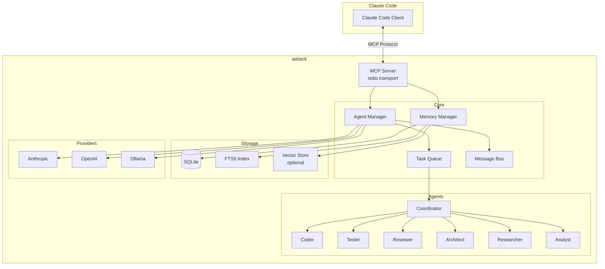

<div align="center">

# aistack

### Clean Agent Orchestration for Claude Code

[](https://github.com/blackms/aistack/actions/workflows/ci.yml)
[](https://www.npmjs.com/package/@blackms/aistack)
[](https://www.npmjs.com/package/@blackms/aistack)
[](https://bundlephobia.com/package/@blackms/aistack)
[](https://codecov.io/gh/blackms/aistack)
[](LICENSE)

[](https://nodejs.org)
[](https://www.typescriptlang.org/)
[](https://modelcontextprotocol.io/)

<br/>

**Lightweight, extensible multi-agent system with memory persistence and MCP integration.**

[Installation](#installation) • [Quick Start](#quick-start) • [Architecture](#architecture) • [API](#mcp-tools) • [Plugins](#plugin-development)

</div>

---

## Overview

aistack provides a minimal, production-ready foundation for agent orchestration in Claude Code. It combines hierarchical agent coordination, persistent memory with full-text search, and seamless MCP server integration.

```
7 agents • 30 MCP tools • 3 LLM providers • SQLite + FTS5 • Plugin system
```

---

## Installation

```bash
npm install @blackms/aistack
```

**Requirements:** Node.js 20+

---

## Quick Start

```bash
# Initialize project
npx @blackms/aistack init

# Add MCP server to Claude Code
claude mcp add aistack -- npx @blackms/aistack mcp start

# Check system status
npx @blackms/aistack status
```

---

## Architecture



---

## Core Modules

| Module | Description |
|--------|-------------|
| **agents** | 7 built-in agent types with capabilities and system prompts |
| **memory** | SQLite store with FTS5 full-text search and optional vector embeddings |
| **mcp** | MCP server exposing 30 tools via stdio transport |
| **coordination** | Hierarchical coordinator, task queue, and message bus |
| **providers** | Anthropic, OpenAI, and Ollama LLM integrations |
| **hooks** | 4 lifecycle events: session-start, session-end, pre-task, post-task |
| **plugins** | Runtime extensibility for agents, tools, and hooks |

---

## CLI Commands

| Command | Description |
|---------|-------------|
| `init` | Initialize project with config and data directory |
| `agent spawn -t <type>` | Spawn an agent |
| `agent list` | List active agents |
| `agent stop -n <name>` | Stop an agent |
| `memory store -k <key> -c <content>` | Store key-value pair |
| `memory search -q <query>` | Full-text search |
| `mcp start` | Start MCP server |
| `status` | System status |

---

## Agents

| Type | Capabilities |
|------|--------------|
| **coder** | write-code, edit-code, refactor, debug, implement-features |
| **researcher** | search-code, read-documentation, analyze-patterns, gather-requirements, explore-codebase |
| **tester** | write-tests, run-tests, identify-edge-cases, coverage-analysis, test-debugging |
| **reviewer** | code-review, security-review, performance-review, best-practices, feedback |
| **architect** | system-design, technical-decisions, architecture-review, documentation, trade-off-analysis |
| **coordinator** | task-decomposition, agent-coordination, progress-tracking, result-synthesis, workflow-management |
| **analyst** | data-analysis, performance-profiling, metrics-collection, trend-analysis, reporting |

---

## MCP Tools

### Agent Tools (6)
```
agent_spawn      agent_list       agent_stop
agent_status     agent_types      agent_update_status
```

### Memory Tools (5)
```
memory_store     memory_search    memory_get
memory_list      memory_delete
```

### Task Tools (5)
```
task_create      task_assign      task_complete
task_list        task_get
```

### Session Tools (4)
```
session_start    session_end      session_status
session_active
```

### System Tools (3)
```
system_status    system_health    system_config
```

### GitHub Tools (7)
```
github_issue_create    github_issue_list    github_issue_get
github_pr_create       github_pr_list       github_pr_get
github_repo_info
```

---

## Configuration

Create `aistack.config.json`:

```json
{
  "version": "1.0.0",
  "memory": {
    "path": "./data/aistack.db",
    "defaultNamespace": "default",
    "vectorSearch": {
      "enabled": false,
      "provider": "openai",
      "model": "text-embedding-3-small"
    }
  },
  "providers": {
    "default": "anthropic",
    "anthropic": {
      "apiKey": "${ANTHROPIC_API_KEY}"
    },
    "openai": {
      "apiKey": "${OPENAI_API_KEY}"
    },
    "ollama": {
      "baseUrl": "http://localhost:11434"
    }
  },
  "agents": {
    "maxConcurrent": 5,
    "defaultTimeout": 300
  },
  "github": {
    "enabled": false,
    "useGhCli": true
  },
  "hooks": {
    "sessionStart": true,
    "sessionEnd": true,
    "preTask": true,
    "postTask": true
  },
  "plugins": {
    "enabled": true,
    "directory": "./plugins"
  }
}
```

---

## Programmatic Usage

```typescript
import {
  spawnAgent,
  getMemoryManager,
  startMCPServer,
  getConfig,
} from '@blackms/aistack';

// Load configuration
const config = getConfig();

// Spawn an agent
const agent = spawnAgent('coder', { name: 'my-coder' });

// Use memory
const memory = getMemoryManager(config);
await memory.store('patterns', 'Use dependency injection', {
  namespace: 'architecture'
});
const results = await memory.search('injection');

// Start MCP server
const server = await startMCPServer(config);
```

### Submodule Imports

```typescript
// Memory only
import { MemoryManager } from '@blackms/aistack/memory';

// Agents only
import { spawnAgent, getAgentRegistry } from '@blackms/aistack/agents';

// MCP server only
import { startMCPServer } from '@blackms/aistack/mcp';
```

---

## Plugin Development

```typescript
import type { AgentStackPlugin } from '@blackms/aistack';

export default {
  name: 'my-plugin',
  version: '1.0.0',

  agents: [{
    type: 'custom-agent',
    name: 'Custom Agent',
    description: 'Specialized behavior',
    systemPrompt: 'You are a custom agent...',
    capabilities: ['custom-task'],
  }],

  tools: [{
    name: 'custom_tool',
    description: 'A custom MCP tool',
    inputSchema: {
      type: 'object',
      properties: {
        input: { type: 'string' }
      }
    },
    handler: async (params) => ({ result: 'done' })
  }],

  hooks: [{
    event: 'post-task',
    handler: async (ctx) => {
      console.log('Task completed:', ctx.taskId);
    }
  }],

  async init(config) {
    // Setup logic
  },

  async cleanup() {
    // Teardown logic
  }
} satisfies AgentStackPlugin;
```

---

## Providers

| Provider | Models | Features |
|----------|--------|----------|
| **Anthropic** | claude-sonnet-4-20250514 | Chat |
| **OpenAI** | gpt-4o | Chat, Embeddings |
| **Ollama** | llama3.2, nomic-embed-text | Chat, Embeddings (local) |

---

## Project Structure

```
src/
├── agents/         # Agent definitions and spawner
├── cli/            # CLI commands (Commander.js)
├── coordination/   # Task queue, message bus, topology
├── github/         # GitHub integration
├── hooks/          # Lifecycle hooks
├── mcp/            # MCP server and tools
├── memory/         # SQLite, FTS5, vector search
├── plugins/        # Plugin loader and registry
├── providers/      # LLM provider implementations
└── utils/          # Config, logger, validation
```

---

## Development

```bash
# Install dependencies
npm install

# Build
npm run build

# Run tests
npm test

# Type check
npm run typecheck

# Lint
npm run lint
```

---

## License

MIT

---

<div align="center">

**[Documentation](https://github.com/blackms/aistack)** • **[Issues](https://github.com/blackms/aistack/issues)**

</div>
