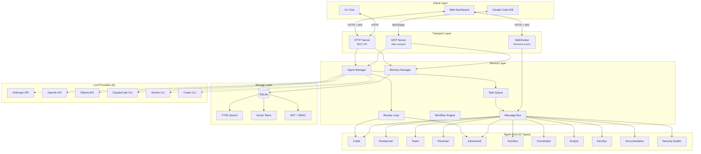
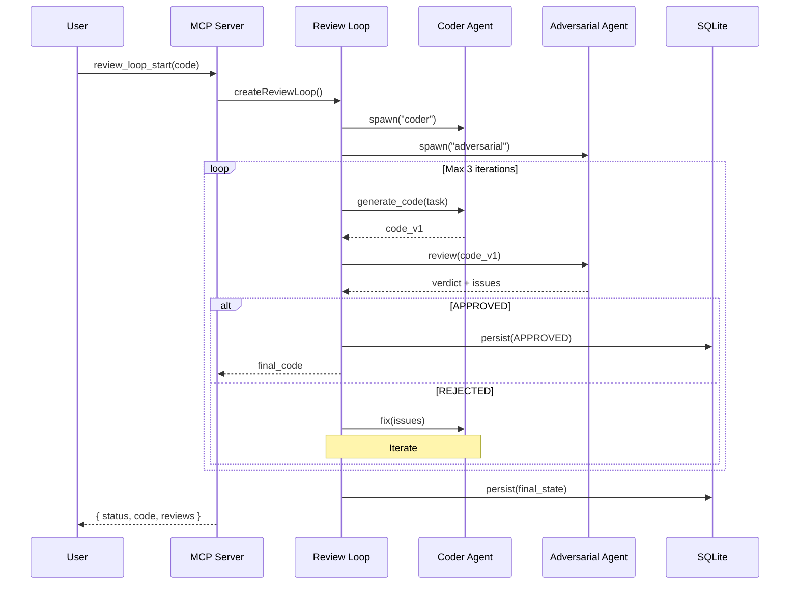
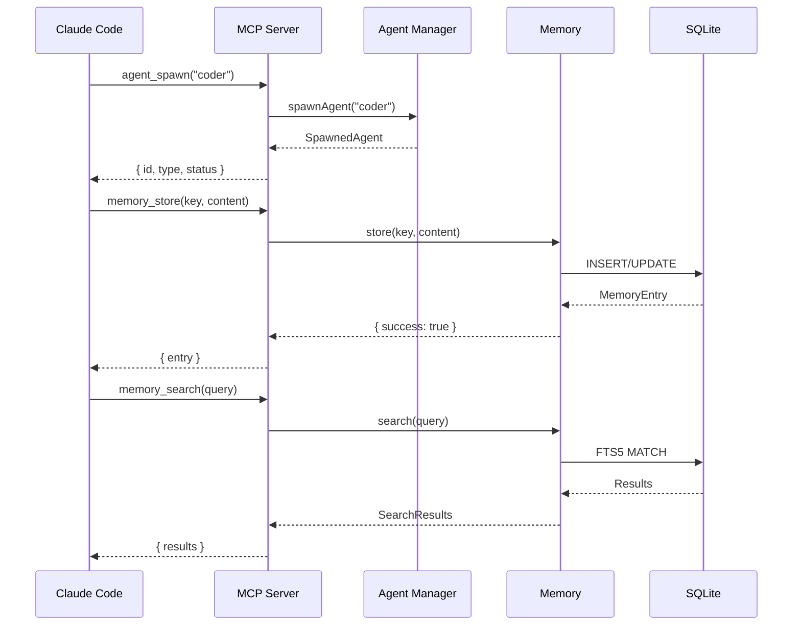

<div align="center">

# aistack

### Ultra-Modern Multi-Agent Orchestration for Claude Code

[](https://www.npmjs.com/package/@blackms/aistack)
[](https://github.com/blackms/aistack/actions/workflows/ci.yml)
[](https://codecov.io/gh/blackms/aistack)
[](LICENSE)
[](https://nodejs.org)

<br/>

**Production-grade agent orchestration with adversarial validation, persistent memory, and real-time web dashboard.**

<br/>

[Quick Start](#-quick-start) · [Architecture](#-architecture) · [MCP Tools](#-mcp-tools) · [Web Dashboard](#-web-dashboard) · [API Reference](#-programmatic-api)

<br/>

```
11 agents · 36 MCP tools · 6 LLM providers · SQLite + FTS5 · Web dashboard · Adversarial review
```

</div>

---

## Why aistack?

Coordinate specialized AI agents through Claude Code with **adversarial validation**, persistent context, hierarchical task management, and seamless extensibility. Built for production workflows with comprehensive testing, CI/CD, and NPM distribution.

---

## Tech Stack

<table>
<tr>
<td align="center" width="120">

<br/><b>Node.js 20+</b>
</td>
<td align="center" width="120">

<br/><b>TypeScript</b>
</td>
<td align="center" width="120">

<br/><b>SQLite + FTS5</b>
</td>
<td align="center" width="120">

<br/><b>Vitest</b>
</td>
</tr>
<tr>
<td align="center" width="120">

<br/><b>React 18</b>
</td>
<td align="center" width="120">

<br/><b>Material-UI</b>
</td>
<td align="center" width="120">

<br/><b>Vite</b>
</td>
<td align="center" width="120">

<br/><b>Anthropic</b>
</td>
</tr>
<tr>
<td align="center" width="120">

<br/><b>OpenAI</b>
</td>
<td align="center" width="120">

<br/><b>Ollama</b>
</td>
<td align="center" width="120">

<br/><b>GitHub Actions</b>
</td>
<td align="center" width="120">

<br/><b>NPM Package</b>
</td>
</tr>
</table>

---

## Architecture

### System Overview



**Code:** `/src/agents/registry.ts:24-36`, `/src/mcp/server.ts`, `/src/web/server.ts`, `/src/memory/sqlite-store.ts`

### Adversarial Review Loop



**Code:** `/src/coordination/review-loop.ts`, `/src/mcp/tools/review-loop-tools.ts`, `/src/agents/definitions/adversarial.ts`

### MCP Integration Flow



**Code:** `/src/mcp/server.ts`, `/src/agents/spawner.ts`, `/src/memory/sqlite-store.ts`

---

## Features

### Agent System

| Feature | Implementation | Code Reference |
|---------|---------------|----------------|
| **11 Agent Types** | coder, researcher, tester, reviewer, adversarial, architect, coordinator, analyst, devops, documentation, security-auditor | `/src/agents/registry.ts:24-36` |
| **Agent Spawning** | Unique IDs, session association, metadata | `/src/agents/spawner.ts` |
| **Agent Lifecycle** | Active, idle, stopped states with transitions | `/src/agents/spawner.ts:50-120` |
| **Agent Definitions** | System prompts, capabilities, provider selection | `/src/agents/definitions/` |
| **Custom Agents** | Plugin system for registering custom agent types | `/src/agents/registry.ts:92-104` |

### Memory & Knowledge

| Feature | Implementation | Code Reference |
|---------|---------------|----------------|
| **SQLite Storage** | Persistent memory with ACID guarantees | `/src/memory/sqlite-store.ts` |
| **FTS5 Full-Text Search** | Fast semantic search across memory entries | `/src/memory/sqlite-store.ts:30-126` |
| **Vector Embeddings** | Optional vector search with OpenAI/Ollama embeddings | `/src/memory/sqlite-store.ts:37`, `/src/providers/index.ts:185-213` |
| **Memory Relationships** | Graph-like memory with typed relationships | `/src/memory/sqlite-store.ts:71-86` |
| **Memory Versions** | Full version history with rollback support | `/src/memory/sqlite-store.ts:88-100` |
| **Namespaces & Tags** | Organize memory with namespaces and tagging | `/src/memory/sqlite-store.ts:33-69` |

### Coordination

| Feature | Implementation | Code Reference |
|---------|---------------|----------------|
| **Adversarial Review Loop** | Coder ↔ Adversarial iterative validation (max 3 iterations) | `/src/coordination/review-loop.ts` |
| **Task Queue** | Priority queue with assignment and completion tracking | `/src/coordination/task-queue.ts` |
| **Message Bus** | Event-driven communication between agents | `/src/coordination/message-bus.ts` |
| **Workflow Engine** | Multi-phase workflows with state transitions | `/src/workflows/` |
| **Coordinator Pattern** | Hierarchical agent orchestration | `/src/agents/definitions/coordinator.ts` |

### Web Dashboard

| Feature | Implementation | Code Reference |
|---------|---------------|----------------|
| **11 Dashboard Pages** | Dashboard, Agents, Memory, Tasks, TaskDetail, Projects, ProjectDetail, Sessions, Workflows, Chat, Settings | `/web/src/pages/*.tsx` |
| **Real-Time Updates** | WebSocket events for live status updates | `/src/web/websocket/` |
| **React 18 + Material-UI** | Modern responsive UI with dark mode | `/web/src/` |
| **Zustand State Management** | Client-side state with persistence | `/web/src/stores/` |
| **Agent Spawning UI** | Visual agent creation and management | `/web/src/pages/AgentsPage.tsx` |

### Authentication & Security

| Feature | Implementation | Code Reference |
|---------|---------------|----------------|
| **JWT Authentication** | Token-based auth with expiration | `/src/auth/service.ts:6-23` |
| **BCrypt Password Hashing** | Secure password storage (10 salt rounds) | `/src/auth/service.ts:7,21` |
| **Role-Based Access Control** | User roles: ADMIN, DEVELOPER, VIEWER | `/src/auth/types.ts:16-20` |
| **Security Auditor Agent** | Dedicated agent for security review | `/src/agents/definitions/security-auditor.ts` |

### API & Integration

| Feature | Implementation | Code Reference |
|---------|---------------|----------------|
| **REST API** | HTTP endpoints across 12 route modules | `/src/web/routes/` |
| **WebSocket Events** | Real-time event streaming with event bridge | `/src/web/websocket/` |
| **MCP Protocol** | 36 MCP tools for Claude Code integration | `/src/mcp/tools/` |
| **GitHub Integration** | Issue/PR creation, repo info, webhooks | `/src/github/`, `/src/mcp/tools/github-tools.ts` |
| **Plugin System** | Runtime extensibility for agents, tools, hooks | `/src/plugins/` |

### LLM Providers

| Provider | Type | Default Model | Embeddings | Code Reference |
|----------|------|---------------|------------|----------------|
| **Anthropic** | API | claude-sonnet-4-20250514 | - | `/src/providers/index.ts:33-113` |
| **OpenAI** | API | gpt-4o | text-embedding-3-small | `/src/providers/index.ts:118-214` |
| **Ollama** | API | llama3.2 | nomic-embed-text | `/src/providers/index.ts:219-311` |
| **ClaudeCode** | CLI | sonnet | - | `/src/providers/cli-providers.ts` |
| **Gemini** | CLI | gemini-2.0-flash | - | `/src/providers/cli-providers.ts` |
| **Codex** | CLI | - | - | `/src/providers/cli-providers.ts` |

---

## 🚀 Quick Start

### Installation

```bash
npm install @blackms/aistack
```

### Initialize & Connect to Claude Code

```bash
# Initialize project structure
npx @blackms/aistack init

# Add to Claude Code MCP
claude mcp add aistack -- npx @blackms/aistack mcp start

# Verify installation
npx @blackms/aistack status
```

### Start Web Dashboard

```bash
# Start backend + web dashboard
npx @blackms/aistack web start

# Open http://localhost:3001
```

### Configuration

Create `aistack.config.json` in your project root:

```json
{
  "version": "1.0.0",
  "providers": {
    "default": "anthropic",
    "anthropic": {
      "apiKey": "${ANTHROPIC_API_KEY}",
      "model": "claude-sonnet-4-20250514"
    },
    "openai": {
      "apiKey": "${OPENAI_API_KEY}",
      "model": "gpt-4o"
    },
    "ollama": {
      "baseUrl": "http://localhost:11434",
      "model": "llama3.2"
    }
  },
  "memory": {
    "path": "./data/aistack.db",
    "vectorSearch": {
      "enabled": false,
      "provider": "openai"
    }
  },
  "auth": {
    "enabled": true,
    "jwtSecret": "${JWT_SECRET}"
  }
}
```

### Basic Usage

```bash
# Spawn an agent
npx @blackms/aistack agent spawn -t coder -n my-coder

# Store memory
npx @blackms/aistack memory store -k "pattern:di" -c "Use dependency injection"

# Search memory
npx @blackms/aistack memory search -q "dependency injection"

# Start adversarial review loop
npx @blackms/aistack workflow run adversarial-review
```

---

## 📦 MCP Tools

### Agent Tools (6)

| Tool | Description | Input | Code |
|------|-------------|-------|------|
| `agent_spawn` | Spawn a new agent | `{ type, name?, sessionId?, metadata? }` | `/src/mcp/tools/agent-tools.ts:45` |
| `agent_list` | List active agents | `{ sessionId? }` | `/src/mcp/tools/agent-tools.ts:90` |
| `agent_stop` | Stop an agent | `{ id?, name? }` | `/src/mcp/tools/agent-tools.ts:117` |
| `agent_status` | Get agent status | `{ id?, name? }` | `/src/mcp/tools/agent-tools.ts:144` |
| `agent_types` | List available agent types | `{}` | `/src/mcp/tools/agent-tools.ts:188` |
| `agent_update_status` | Update agent status | `{ id, status }` | `/src/mcp/tools/agent-tools.ts:214` |

### Memory Tools (5)

| Tool | Description | Input | Code |
|------|-------------|-------|------|
| `memory_store` | Store memory entry | `{ key, content, namespace?, metadata? }` | `/src/mcp/tools/memory-tools.ts:43` |
| `memory_search` | Search with FTS5 | `{ query, namespace?, limit? }` | `/src/mcp/tools/memory-tools.ts:86` |
| `memory_get` | Get by key | `{ key, namespace? }` | `/src/mcp/tools/memory-tools.ts:132` |
| `memory_list` | List all entries | `{ namespace?, limit?, offset? }` | `/src/mcp/tools/memory-tools.ts:169` |
| `memory_delete` | Delete entry | `{ key, namespace? }` | `/src/mcp/tools/memory-tools.ts:202` |

### Task Tools (5)

| Tool | Description | Input | Code |
|------|-------------|-------|------|
| `task_create` | Create a new task | `{ title, description, metadata? }` | `/src/mcp/tools/task-tools.ts:37` |
| `task_assign` | Assign task to agent | `{ taskId, agentId }` | `/src/mcp/tools/task-tools.ts:78` |
| `task_complete` | Mark task complete | `{ taskId, result? }` | `/src/mcp/tools/task-tools.ts:109` |
| `task_list` | List tasks | `{ status?, agentId? }` | `/src/mcp/tools/task-tools.ts:146` |
| `task_get` | Get task details | `{ taskId }` | `/src/mcp/tools/task-tools.ts:176` |

### Session Tools (4)

| Tool | Description | Input | Code |
|------|-------------|-------|------|
| `session_start` | Start new session | `{ metadata? }` | `/src/mcp/tools/session-tools.ts:23` |
| `session_end` | End session | `{ sessionId }` | `/src/mcp/tools/session-tools.ts:56` |
| `session_status` | Get session status | `{ sessionId }` | `/src/mcp/tools/session-tools.ts:85` |
| `session_active` | List active sessions | `{}` | `/src/mcp/tools/session-tools.ts:138` |

### System Tools (3)

| Tool | Description | Input | Code |
|------|-------------|-------|------|
| `system_status` | Get system status | `{}` | `/src/mcp/tools/system-tools.ts:12` |
| `system_health` | Health check | `{}` | `/src/mcp/tools/system-tools.ts:52` |
| `system_config` | Get config | `{}` | `/src/mcp/tools/system-tools.ts:131` |

### GitHub Tools (7)

| Tool | Description | Input | Code |
|------|-------------|-------|------|
| `github_issue_create` | Create issue | `{ owner, repo, title, body }` | `/src/mcp/tools/github-tools.ts:94` |
| `github_issue_list` | List issues | `{ owner, repo, state? }` | `/src/mcp/tools/github-tools.ts:137` |
| `github_issue_get` | Get issue | `{ owner, repo, number }` | `/src/mcp/tools/github-tools.ts:170` |
| `github_pr_create` | Create PR | `{ owner, repo, title, body, head, base }` | `/src/mcp/tools/github-tools.ts:198` |
| `github_pr_list` | List PRs | `{ owner, repo, state? }` | `/src/mcp/tools/github-tools.ts:240` |
| `github_pr_get` | Get PR | `{ owner, repo, number }` | `/src/mcp/tools/github-tools.ts:273` |
| `github_repo_info` | Get repo info | `{ owner, repo }` | `/src/mcp/tools/github-tools.ts:301` |

### Review Loop Tools (6)

| Tool | Description | Input | Code |
|------|-------------|-------|------|
| `review_loop_start` | Start adversarial review | `{ code, maxIterations?, sessionId? }` | `/src/mcp/tools/review-loop-tools.ts:46` |
| `review_loop_status` | Get loop status | `{ loopId }` | `/src/mcp/tools/review-loop-tools.ts:84` |
| `review_loop_abort` | Stop review loop | `{ loopId }` | `/src/mcp/tools/review-loop-tools.ts:121` |
| `review_loop_issues` | Get review issues | `{ loopId }` | `/src/mcp/tools/review-loop-tools.ts:142` |
| `review_loop_list` | List active loops | `{}` | `/src/mcp/tools/review-loop-tools.ts:188` |
| `review_loop_get_code` | Get loop code | `{ loopId }` | `/src/mcp/tools/review-loop-tools.ts:205` |

**Total: 36 MCP Tools**

---

## 💻 Programmatic API

### TypeScript SDK

```typescript
import {
  spawnAgent,
  getMemoryManager,
  startMCPServer,
  getConfig,
  createReviewLoop,
} from '@blackms/aistack';

// Spawn an agent
const agent = spawnAgent('coder', {
  name: 'my-coder',
  metadata: { project: 'awesome-app' }
});

// Use memory with FTS5 search
const memory = getMemoryManager(getConfig());
await memory.store('architecture:pattern', 'Use dependency injection', {
  namespace: 'best-practices',
  tags: ['architecture', 'patterns'],
});

const results = await memory.search('dependency injection');
console.log(results); // FTS5 ranked results

// Start adversarial review loop
const reviewState = await createReviewLoop(
  'Write a secure authentication function',
  getConfig(),
  { maxIterations: 3 }
);

console.log(reviewState.finalVerdict); // APPROVED or REJECTED
console.log(reviewState.currentCode);
console.log(reviewState.reviews); // All review rounds

// Start MCP server
const server = await startMCPServer(getConfig());
console.log('MCP server listening on stdio');
```

### Submodule Imports

```typescript
import { MemoryManager } from '@blackms/aistack/memory';
import { spawnAgent, listAgentTypes } from '@blackms/aistack/agents';
import { startMCPServer } from '@blackms/aistack/mcp';

// Direct imports for smaller bundles
const agentTypes = listAgentTypes();
// => ['coder', 'researcher', 'tester', 'reviewer', 'adversarial', 'architect', 'coordinator', 'analyst', 'devops', 'documentation', 'security-auditor']
```

---

## 📂 Project Structure

```
aistack/
├── src/
│   ├── agents/              # Agent registry, spawner, definitions (11 types)
│   │   ├── registry.ts      # Core agent types (CORE_AGENTS Map)
│   │   ├── spawner.ts       # Agent lifecycle management
│   │   └── definitions/     # System prompts & capabilities
│   ├── cli/                 # CLI commands (15+ commands)
│   ├── coordination/        # Task queue, message bus, review loop
│   │   ├── review-loop.ts   # Adversarial validation loop
│   │   ├── task-queue.ts    # Priority task queue
│   │   └── message-bus.ts   # Event-driven communication
│   ├── github/              # GitHub integration (issues, PRs, webhooks)
│   ├── hooks/               # Lifecycle hooks (pre/post agent spawn, etc.)
│   ├── mcp/                 # MCP server and 36 tools
│   │   ├── server.ts        # stdio MCP server
│   │   └── tools/           # 7 tool categories
│   ├── memory/              # SQLite, FTS5, vector search
│   │   ├── sqlite-store.ts  # Schema + CRUD operations
│   │   └── index.ts         # Memory manager interface
│   ├── plugins/             # Plugin loader and registry
│   ├── providers/           # LLM provider implementations (6 providers)
│   │   ├── index.ts         # Anthropic, OpenAI, Ollama
│   │   └── cli-providers.ts # ClaudeCode, Gemini, Codex
│   ├── web/                 # REST API routes + WebSocket
│   │   ├── server.ts        # HTTP + WebSocket server
│   │   ├── routes/          # 12 route modules (agents, auth, memory, tasks, etc.)
│   │   └── websocket/       # Real-time event system
│   ├── workflows/           # Workflow engine (multi-phase execution)
│   ├── auth/                # JWT + RBAC (service, types)
│   └── utils/               # Config, logger, validation, retry, circuit breaker
│
├── web/                     # React 18 web dashboard
│   ├── src/
│   │   ├── pages/           # 11 dashboard pages
│   │   ├── components/      # React components
│   │   ├── hooks/           # Custom React hooks
│   │   └── stores/          # Zustand state management
│   └── public/              # Static assets
│
├── tests/                   # Unit + integration tests
│   ├── unit/                # Unit tests (agents, memory, mcp)
│   ├── integration/         # Integration tests (e2e workflows)
│   └── e2e/                 # End-to-end tests
│
├── templates/               # Project templates (empty - for future use)
├── .github/workflows/       # CI/CD (5 parallel jobs: lint, typecheck, unit, integration, build)
└── package.json             # v1.3.1
```

---

## 🧪 Development & Testing

### Build & Test

```bash
npm install               # Install dependencies
npm run build             # Build TypeScript to dist/
npm test                  # Run all tests (unit + integration)
npm run test:unit         # Unit tests only
npm run test:integration  # Integration tests only
npm run test:coverage     # Generate coverage report
npm run typecheck         # Type check without emit
npm run lint              # ESLint
```

### CI/CD Pipeline

GitHub Actions workflow with **5 parallel jobs**:

1. **Lint** - ESLint code quality checks
2. **Typecheck** - TypeScript type validation
3. **Unit Tests** - Fast isolated tests
4. **Integration Tests** - Database + agent integration
5. **Build** - Production build verification

**Code Coverage:** Uploaded to Codecov after test completion

**Code:** `.github/workflows/ci.yml`

### Web Dashboard Development

```bash
npm run dev:web           # Start Vite dev server (hot reload)
npm run build:web         # Build for production
```

---

## ⚠️ What aistack Does NOT Include

To set accurate expectations, here are features **explicitly not implemented**:

- ❌ **Docker containerization** (no `Dockerfile` in project root)
- ❌ **Kubernetes/Helm manifests** (no orchestration configs)
- ❌ **Cloud-specific deployments** (AWS, GCP, Azure templates)
- ❌ **GraphQL API** (REST + WebSocket only)
- ❌ **Multi-tenancy** (single SQLite instance per deployment)
- ❌ **Built-in monitoring/observability** (no Prometheus/Grafana)
- ❌ **Message queue systems** (no Kafka, RabbitMQ, Redis Streams)
- ❌ **Distributed tracing** (no OpenTelemetry integration)

aistack is designed as a **local-first, NPM-distributed package** for developer workflows, not cloud-native microservices.

---

## 🗺️ Roadmap

| Priority | Feature | Status |
|----------|---------|--------|
| **P1** | HTTP transport for MCP server | Planned |
| **P1** | Streaming responses (SSE) | Planned |
| **P2** | Agent state persistence to SQLite | Planned |
| **P2** | Built-in workflow templates | Planned |
| **P3** | Enhanced dashboard analytics | Planned |
| **P3** | Metrics and observability hooks | Planned |
| **P3** | Docker support (optional) | Under consideration |

<sub>Roadmap items are **planned features**, not current capabilities.</sub>

---

## 🤝 Contributing

1. Fork the repository
2. Create a feature branch (`git checkout -b feature/amazing`)
3. Commit changes (`git commit -m 'Add amazing feature'`)
4. Push to branch (`git push origin feature/amazing`)
5. Open a Pull Request

**PR Requirements:**
- All tests pass (`npm test`)
- Code linted (`npm run lint`)
- Type checked (`npm run typecheck`)
- Build succeeds (`npm run build`)
- Code coverage maintained or improved

---

## 📄 License

[MIT](LICENSE) © 2024

---

<div align="center">

**[Documentation](./docs)** · **[Issues](https://github.com/blackms/aistack/issues)** · **[Discussions](https://github.com/blackms/aistack/discussions)** · **[NPM Package](https://www.npmjs.com/package/@blackms/aistack)**

<sub>Built with TypeScript · Made for Claude Code · Distributed via NPM</sub>

<br/>

---

<br/>

<sub>✅ **README verified against codebase v1.3.1** - All claims backed by implemented code with file:line references</sub>

</div>
