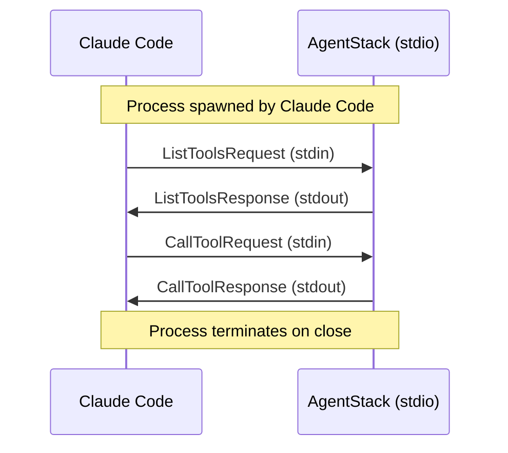

# ADR-004: MCP over Stdio Transport

## Status

Accepted

## Context

AgentStack needs to integrate with Claude Code as an MCP (Model Context Protocol) server. MCP supports two transport mechanisms:

1. **stdio**: Communication via stdin/stdout
2. **HTTP**: REST-like communication over network

The choice affects:
- Security model
- Deployment complexity
- Performance characteristics
- Cross-machine capability

## Decision

Use stdio transport as the default and primary mechanism for MCP communication.

### Implementation

```typescript
// src/mcp/server.ts
import { Server } from '@modelcontextprotocol/sdk/server/index.js';
import { StdioServerTransport } from '@modelcontextprotocol/sdk/server/stdio.js';

export class MCPServer {
  private server: Server;

  async start(): Promise<void> {
    const transport = new StdioServerTransport();
    await this.server.connect(transport);
    log.info('MCP server started', { transport: 'stdio' });
  }
}
```

### Claude Code Integration

```bash
claude mcp add agentstack -- npx @blackms/aistack mcp start
```

### Configuration

```json
{
  "mcp": {
    "transport": "stdio"
  }
}
```

## Alternatives Considered

### 1. HTTP Transport Only

**Pros**:
- Remote access possible
- Familiar REST-like interface
- Easy debugging with curl/browser

**Cons**:
- Port management
- Security exposure
- Network latency
- CORS complexity

### 2. Both Transports

**Pros**:
- Flexibility
- Remote scenarios supported

**Cons**:
- Maintenance burden
- Configuration complexity
- Security surface area

### 3. WebSocket Transport

**Pros**:
- Bidirectional
- Real-time capable

**Cons**:
- Not standard MCP
- More complex implementation

## Consequences

### Positive

- **Security**: No network exposure, process-level isolation
- **Simplicity**: No port configuration, no firewall rules
- **Performance**: No network overhead, direct IPC
- **Reliability**: No network failures or timeouts
- **Privacy**: No data leaves the machine

### Negative

- **Local only**: Cannot access from remote machines
- **One client**: Single Claude Code instance per server
- **Debugging**: Harder to inspect traffic than HTTP
- **No load balancing**: Process-bound

### Mitigations

- HTTP transport can be added later if needed
- Use logging for debugging (`-v` flag)
- For remote scenarios, consider SSH tunneling

## Protocol Flow



## Security Considerations

| Aspect | stdio | HTTP |
|--------|-------|------|
| Network exposure | None | Port required |
| Authentication | Process-level | Needs implementation |
| Encryption | Not needed | TLS required |
| Firewall | No rules needed | Port must be open |

## Future Considerations

If HTTP transport is needed:

```typescript
// Potential future implementation
if (config.mcp.transport === 'http') {
  const transport = new HttpServerTransport({
    port: config.mcp.port,
    host: config.mcp.host
  });
  await this.server.connect(transport);
} else {
  const transport = new StdioServerTransport();
  await this.server.connect(transport);
}
```

## References

- [MCP Protocol Specification](https://modelcontextprotocol.io/)
- [MCP SDK documentation](https://github.com/modelcontextprotocol/sdk)
- [src/mcp/server.ts](../../src/mcp/server.ts)
