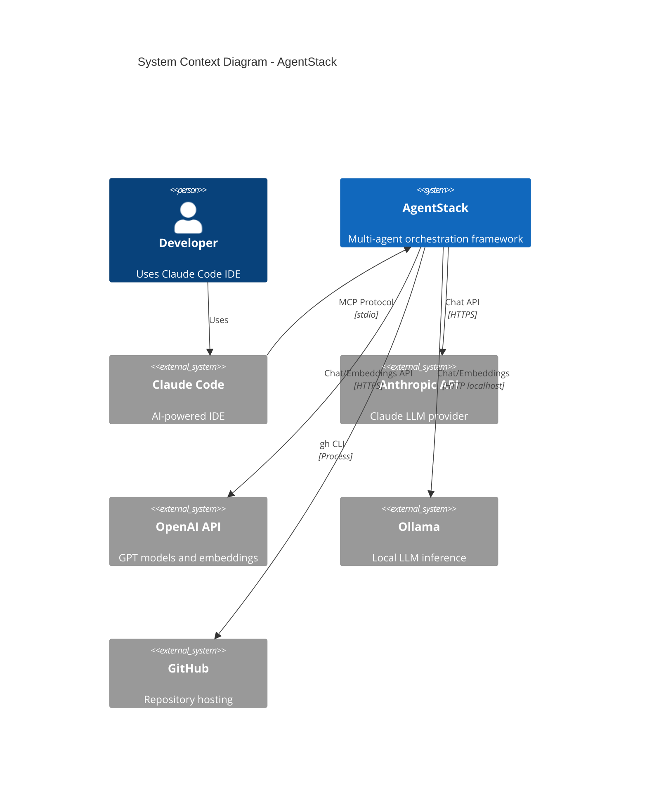
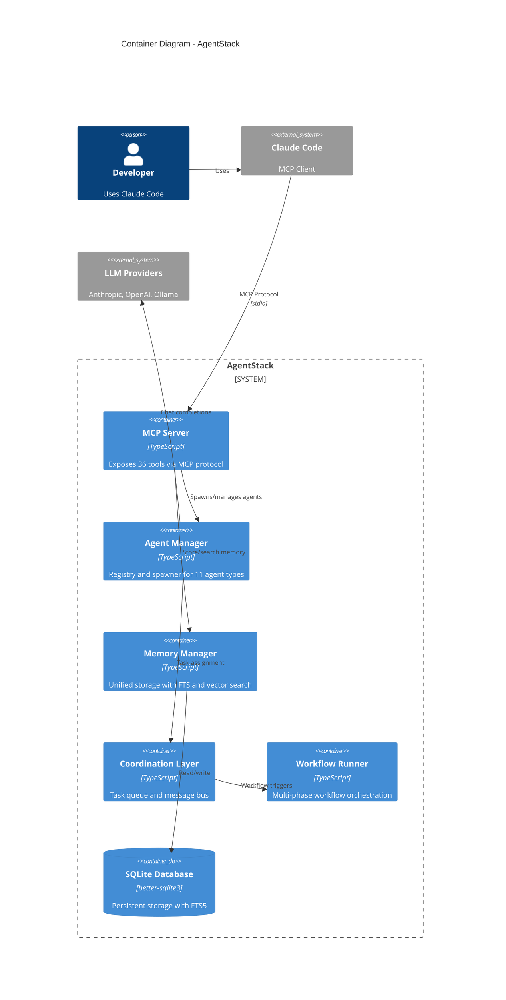
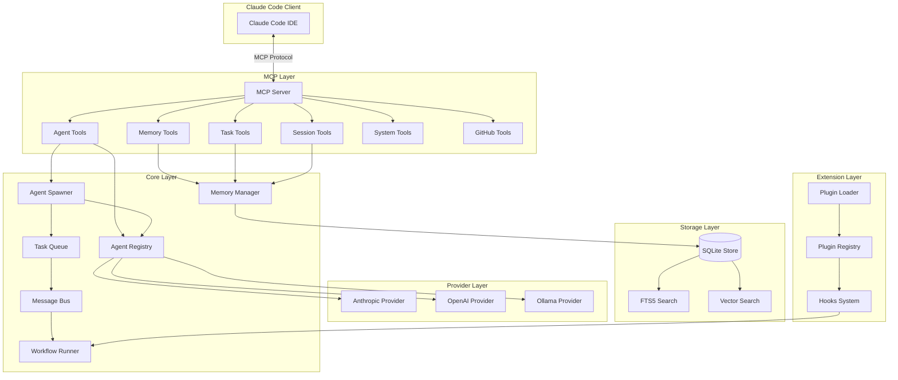
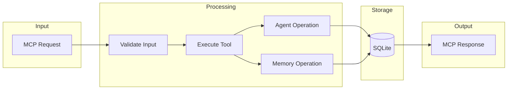
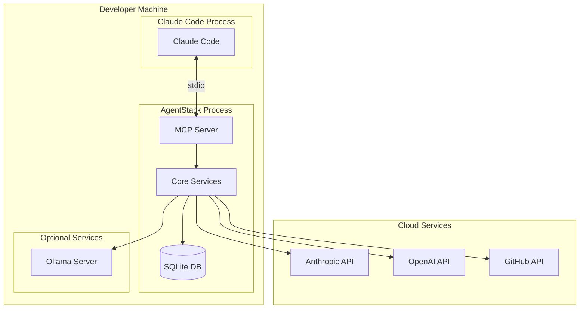

# Architecture Overview

> System architecture documentation with C4 diagrams

## System Purpose

AgentStack solves the core problem of coordinating multiple AI agents with specialized roles to complete complex tasks. It provides:

- **Agent Coordination**: Managing agents with different specializations and routing tasks efficiently
- **Persistent Memory**: Maintaining state and context using SQLite with full-text and vector search
- **MCP Integration**: Seamless Model Context Protocol server via stdio transport
- **LLM Abstraction**: Supporting 6 providers (Anthropic, OpenAI, Ollama, Claude Code CLI, Gemini CLI, Codex) with a unified interface
- **Runtime Extensibility**: Plugin system for extending functionality without modifying core

## C4 Context Diagram



## C4 Container Diagram



## Component Diagram



## Data Flow Diagram



## Deployment Diagram



## Key Design Principles

### 1. Singleton Pattern
Configuration, Memory Manager, Message Bus, and Workflow Runner use singletons for application-wide state consistency.

### 2. EventEmitter-Based Communication
Task Queue, Message Bus, and Workflow Runner emit events for loose coupling and lifecycle tracking.

### 3. Provider Strategy Pattern
LLM providers (Anthropic, OpenAI, Ollama) implement a common interface, enabling runtime switching.

### 4. Layered Architecture
Clear separation between:
- **MCP Layer**: External interface
- **Core Layer**: Business logic
- **Storage Layer**: Persistence
- **Provider Layer**: External integrations
- **Extension Layer**: Plugins and hooks

### 5. Graceful Degradation
Optional features (vector search, GitHub integration) degrade gracefully when not configured.

## Technology Stack

| Component | Technology | Purpose |
|-----------|------------|---------|
| Runtime | Node.js 20+ | JavaScript runtime |
| Language | TypeScript 5.7 | Type safety |
| Database | SQLite 3 (better-sqlite3) | Embedded persistence |
| Search | FTS5 | Full-text search |
| Validation | Zod | Runtime schema validation |
| CLI | Commander.js | Command-line interface |
| Protocol | MCP SDK | Claude Code integration |

## Module Structure

```
src/
├── index.ts           # Public API exports
├── types.ts           # Core type definitions
├── agents/            # Agent definitions and management
│   ├── definitions/   # 11 specialized agent types
│   ├── registry.ts    # Agent type registry
│   └── spawner.ts     # Agent instance management
├── memory/            # Persistent storage
│   ├── sqlite-store.ts
│   ├── fts-search.ts
│   └── vector-search.ts
├── mcp/               # MCP server and tools
│   ├── server.ts
│   └── tools/         # 36 tool implementations
├── coordination/      # Task and message management
│   ├── task-queue.ts
│   ├── message-bus.ts
│   └── topology.ts
├── workflows/         # Multi-phase workflows
├── plugins/           # Plugin system
├── hooks/             # Lifecycle hooks
├── providers/         # LLM provider abstraction
├── github/            # GitHub CLI integration
├── cli/               # Command-line interface
└── utils/             # Shared utilities
```

## Related Documents

- [HLD.md](HLD.md) - Detailed high-level design
- [LLD.md](LLD.md) - Low-level component design
- [DATA.md](DATA.md) - Data model documentation
- [ADRs/](ADRs/) - Architecture decision records
