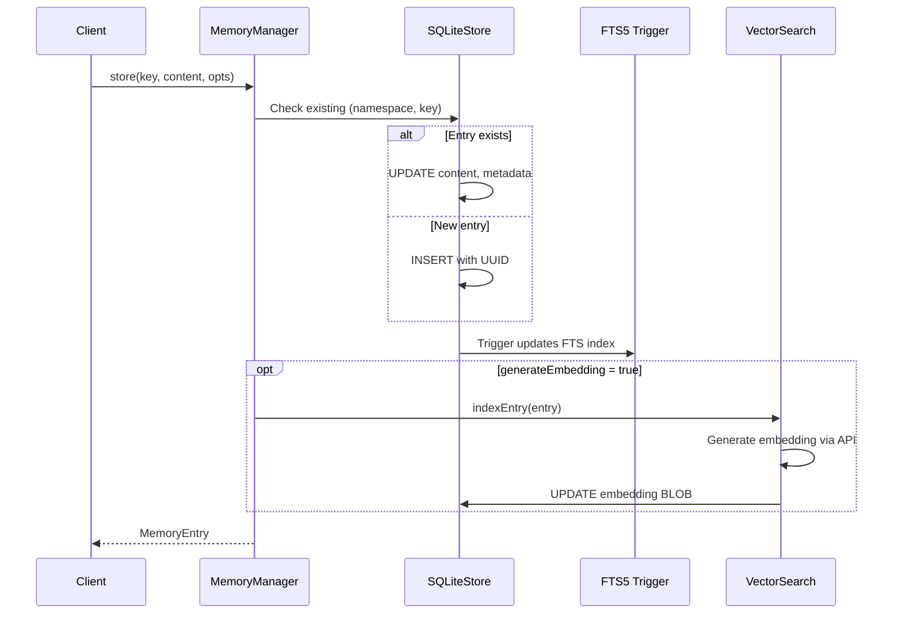
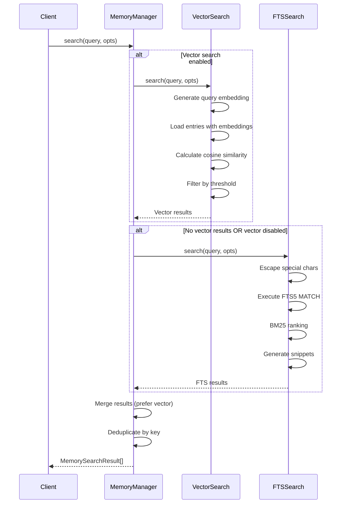
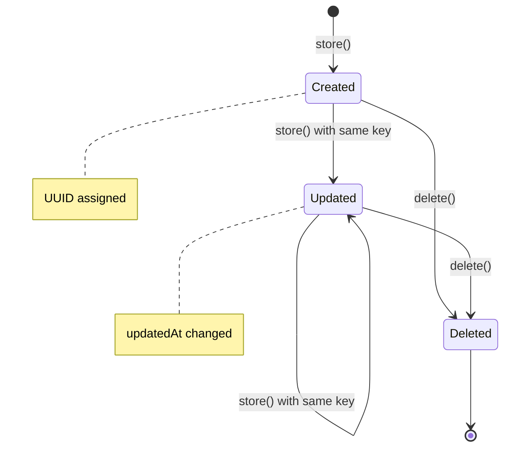
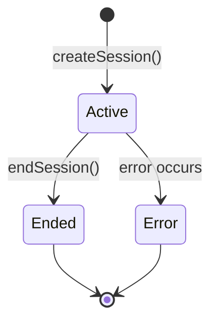
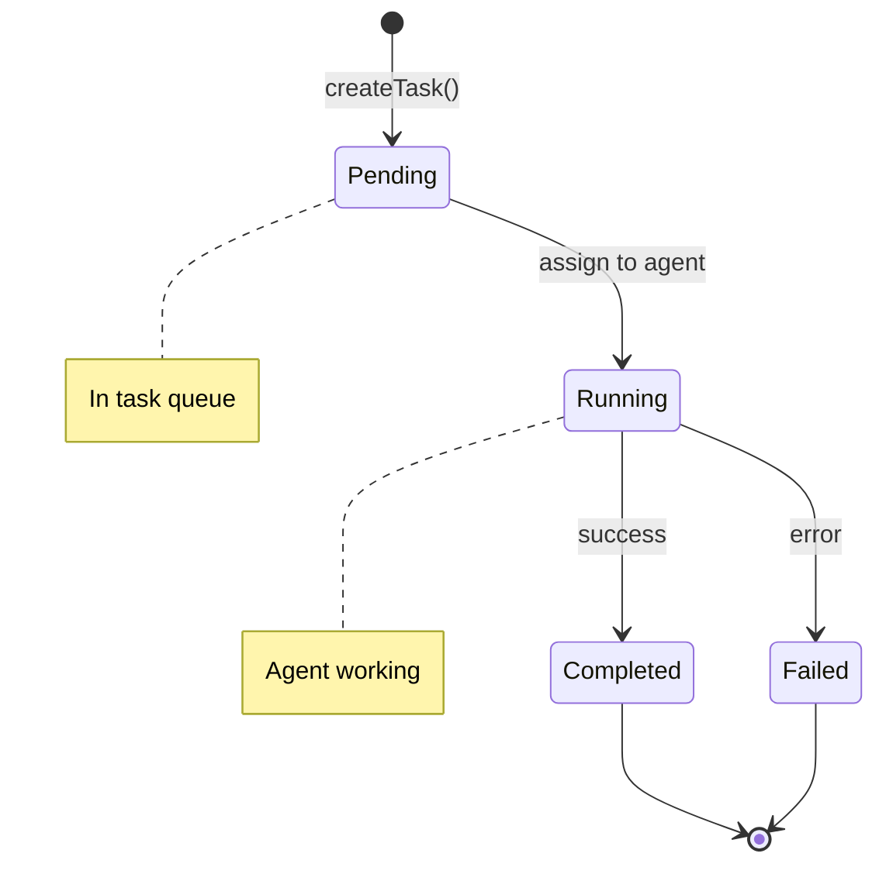

# Data Models & Storage

> Data schemas, storage details, and data flow documentation

## Overview

AgentStack uses SQLite as its primary storage backend via the `better-sqlite3` library. The database includes:

- Core memory storage with FTS5 full-text search
- Session tracking
- Task audit trail
- Optional vector embeddings

## Database Schema

### Memory Table

Primary key-value storage with metadata support.

```sql
CREATE TABLE IF NOT EXISTS memory (
  id TEXT PRIMARY KEY,           -- UUID v4
  key TEXT NOT NULL,             -- User-defined key
  namespace TEXT DEFAULT 'default', -- Logical grouping
  content TEXT NOT NULL,         -- Stored content
  embedding BLOB,                -- Optional Float32Array as bytes
  metadata TEXT,                 -- JSON-encoded metadata
  created_at INTEGER NOT NULL,   -- Unix timestamp (ms)
  updated_at INTEGER NOT NULL,   -- Unix timestamp (ms)
  UNIQUE(namespace, key)         -- Compound unique constraint
);

-- Indexes for common queries
CREATE INDEX IF NOT EXISTS idx_memory_namespace ON memory(namespace);
CREATE INDEX IF NOT EXISTS idx_memory_key ON memory(key);
CREATE INDEX IF NOT EXISTS idx_memory_updated ON memory(updated_at DESC);
```

### FTS5 Virtual Table

Full-text search index synchronized with memory table.

```sql
CREATE VIRTUAL TABLE IF NOT EXISTS memory_fts USING fts5(
  key,                           -- Indexed key
  content,                       -- Indexed content
  namespace,                     -- Indexed namespace
  content=memory,                -- Content table reference
  content_rowid=rowid,           -- Row ID mapping
  tokenize='porter unicode61'    -- Tokenizer with stemming
);
```

### FTS Triggers

Automatic synchronization between memory and FTS tables.

```sql
-- After INSERT
CREATE TRIGGER memory_ai AFTER INSERT ON memory BEGIN
  INSERT INTO memory_fts(rowid, key, content, namespace)
  VALUES (NEW.rowid, NEW.key, NEW.content, NEW.namespace);
END;

-- After DELETE
CREATE TRIGGER memory_ad AFTER DELETE ON memory BEGIN
  INSERT INTO memory_fts(memory_fts, rowid, key, content, namespace)
  VALUES('delete', OLD.rowid, OLD.key, OLD.content, OLD.namespace);
END;

-- After UPDATE
CREATE TRIGGER memory_au AFTER UPDATE ON memory BEGIN
  INSERT INTO memory_fts(memory_fts, rowid, key, content, namespace)
  VALUES('delete', OLD.rowid, OLD.key, OLD.content, OLD.namespace);
  INSERT INTO memory_fts(rowid, key, content, namespace)
  VALUES (NEW.rowid, NEW.key, NEW.content, NEW.namespace);
END;
```

### Sessions Table

Track agent sessions for context management.

```sql
CREATE TABLE IF NOT EXISTS sessions (
  id TEXT PRIMARY KEY,           -- UUID v4
  status TEXT NOT NULL,          -- 'active' | 'ended' | 'error'
  started_at INTEGER NOT NULL,   -- Unix timestamp (ms)
  ended_at INTEGER,              -- Unix timestamp (ms), null if active
  metadata TEXT                  -- JSON-encoded metadata
);

CREATE INDEX IF NOT EXISTS idx_sessions_status ON sessions(status);
```

### Tasks Table

Audit trail for task execution.

```sql
CREATE TABLE IF NOT EXISTS tasks (
  id TEXT PRIMARY KEY,           -- UUID v4
  session_id TEXT,               -- Foreign key to sessions
  agent_type TEXT NOT NULL,      -- Agent type that handles task
  status TEXT NOT NULL,          -- 'pending' | 'running' | 'completed' | 'failed'
  input TEXT,                    -- Task input/description
  output TEXT,                   -- Task output/result
  created_at INTEGER NOT NULL,   -- Unix timestamp (ms)
  completed_at INTEGER,          -- Unix timestamp (ms)
  FOREIGN KEY (session_id) REFERENCES sessions(id)
);

CREATE INDEX IF NOT EXISTS idx_tasks_session ON tasks(session_id);
CREATE INDEX IF NOT EXISTS idx_tasks_status ON tasks(status);
```

### Plugins Table

Plugin state tracking.

```sql
CREATE TABLE IF NOT EXISTS plugins (
  name TEXT PRIMARY KEY,         -- Plugin name (unique identifier)
  version TEXT NOT NULL,         -- Plugin version
  enabled INTEGER DEFAULT 1,     -- Enabled state (0 or 1)
  config TEXT,                   -- JSON-encoded plugin configuration
  installed_at INTEGER NOT NULL  -- Unix timestamp (ms)
);
```

### Users Table

User authentication and authorization.

```sql
CREATE TABLE IF NOT EXISTS users (
  id TEXT PRIMARY KEY,           -- UUID v4
  email TEXT UNIQUE NOT NULL,    -- User email (unique)
  username TEXT UNIQUE NOT NULL, -- Username (unique)
  password_hash TEXT NOT NULL,   -- bcrypt hashed password (10 rounds)
  role TEXT NOT NULL DEFAULT 'developer', -- 'admin' | 'developer' | 'viewer'
  created_at TEXT NOT NULL,      -- ISO timestamp
  updated_at TEXT NOT NULL,      -- ISO timestamp
  last_login_at TEXT             -- ISO timestamp
);

CREATE INDEX IF NOT EXISTS idx_users_email ON users(email);
CREATE INDEX IF NOT EXISTS idx_users_username ON users(username);
```

### Refresh Tokens Table

JWT refresh token management.

```sql
CREATE TABLE IF NOT EXISTS refresh_tokens (
  id TEXT PRIMARY KEY,           -- UUID v4
  user_id TEXT NOT NULL,         -- Foreign key to users
  token_hash TEXT NOT NULL,      -- Hashed refresh token
  expires_at TEXT NOT NULL,      -- ISO timestamp
  created_at TEXT NOT NULL,      -- ISO timestamp
  revoked INTEGER DEFAULT 0,     -- 0 = active, 1 = revoked
  FOREIGN KEY (user_id) REFERENCES users(id) ON DELETE CASCADE
);

CREATE INDEX IF NOT EXISTS idx_refresh_tokens_user ON refresh_tokens(user_id);
CREATE INDEX IF NOT EXISTS idx_refresh_tokens_expires ON refresh_tokens(expires_at);
```

## TypeScript Interfaces

### Memory Entry

```typescript
interface MemoryEntry {
  id: string;                           // UUID v4
  key: string;                          // User-defined key
  namespace: string;                    // Namespace (default: 'default')
  content: string;                      // Stored content
  embedding?: Float32Array;             // Optional vector embedding
  metadata?: Record<string, unknown>;   // JSON metadata
  createdAt: Date;                      // Creation timestamp
  updatedAt: Date;                      // Last update timestamp
}
```

### Memory Search Result

```typescript
interface MemorySearchResult {
  entry: MemoryEntry;                   // The matched entry
  score: number;                        // Relevance score (0-1)
  matchType: 'fts' | 'vector' | 'exact'; // How it was matched
  snippet?: string;                     // FTS highlighted snippet
}
```

### Memory Store Options

```typescript
interface MemoryStoreOptions {
  namespace?: string;                   // Target namespace
  metadata?: Record<string, unknown>;   // Metadata to store
  generateEmbedding?: boolean;          // Generate vector embedding
}
```

### Memory Search Options

```typescript
interface MemorySearchOptions {
  namespace?: string;                   // Filter by namespace
  limit?: number;                       // Max results (default: 10)
  threshold?: number;                   // Vector similarity threshold (default: 0.7)
  useVector?: boolean;                  // Enable vector search
}
```

### Session

```typescript
interface Session {
  id: string;                           // UUID v4
  status: SessionStatus;                // 'active' | 'ended' | 'error'
  startedAt: Date;                      // Start timestamp
  endedAt?: Date;                       // End timestamp
  metadata?: Record<string, unknown>;   // Session metadata
}

type SessionStatus = 'active' | 'ended' | 'error';
```

### Task

```typescript
interface Task {
  id: string;                           // UUID v4
  sessionId?: string;                   // Associated session
  agentType: AgentType | string;        // Target agent type
  status: TaskStatus;                   // Current status
  input?: string;                       // Task input
  output?: string;                      // Task output
  createdAt: Date;                      // Creation timestamp
  completedAt?: Date;                   // Completion timestamp
}

type TaskStatus = 'pending' | 'running' | 'completed' | 'failed';
```

### Agent Types

```typescript
interface AgentDefinition {
  type: AgentType | string;             // Agent type identifier
  name: string;                         // Display name
  description: string;                  // Purpose description
  systemPrompt: string;                 // LLM system prompt
  capabilities: string[];               // Declared capabilities
}

interface SpawnedAgent {
  id: string;                           // UUID v4
  type: AgentType | string;             // Agent type
  name: string;                         // Instance name
  status: AgentStatus;                  // Current status
  createdAt: Date;                      // Spawn timestamp
  sessionId?: string;                   // Associated session
  metadata?: Record<string, unknown>;   // Agent metadata
}

type AgentType = 'coder' | 'researcher' | 'tester' | 'reviewer' | 'adversarial' |
                 'architect' | 'coordinator' | 'analyst' | 'devops' |
                 'documentation' | 'security-auditor';

type AgentStatus = 'idle' | 'running' | 'completed' | 'failed' | 'stopped';
```

## Vector Embeddings

### Storage Format

Embeddings are stored as binary BLOBs in the `embedding` column:

```typescript
// Conversion to BLOB
function float32ArrayToBlob(arr: Float32Array): Buffer {
  return Buffer.from(arr.buffer);
}

// Conversion from BLOB
function blobToFloat32Array(blob: Buffer): Float32Array {
  return new Float32Array(blob.buffer, blob.byteOffset, blob.length / 4);
}
```

### Embedding Dimensions

| Provider | Model | Dimensions |
|----------|-------|------------|
| OpenAI | text-embedding-3-small | 1536 |
| OpenAI | text-embedding-3-large | 3072 |
| Ollama | nomic-embed-text | 768 |

### Similarity Calculation

Cosine similarity for vector search:

```typescript
function cosineSimilarity(a: Float32Array, b: Float32Array): number {
  if (a.length !== b.length) {
    throw new Error('Vectors must have same dimensions');
  }

  let dotProduct = 0;
  let normA = 0;
  let normB = 0;

  for (let i = 0; i < a.length; i++) {
    dotProduct += a[i] * b[i];
    normA += a[i] * a[i];
    normB += b[i] * b[i];
  }

  const denominator = Math.sqrt(normA) * Math.sqrt(normB);
  return denominator === 0 ? 0 : dotProduct / denominator;
}
```

## FTS5 Search

### Query Syntax

| Pattern | Description | Example |
|---------|-------------|---------|
| `term` | Simple term | `config` |
| `term1 term2` | AND (both terms) | `config memory` |
| `"phrase"` | Exact phrase | `"memory manager"` |
| `term*` | Prefix match | `config*` |
| `term OR term` | OR operator | `config OR memory` |

### BM25 Scoring

FTS5 uses BM25 for relevance ranking. Scores are normalized:

```typescript
// Raw BM25 scores are negative (better matches are more negative)
// Normalize to 0-1 range with 3 decimal precision
const normalizedScore = Math.round(
  Math.min(1, Math.max(0, 1 + bm25Score / 25)) * 1000
) / 1000;
```

### Snippet Generation

```sql
SELECT snippet(memory_fts, 1, '<mark>', '</mark>', '...', 64) as snippet
FROM memory_fts
WHERE memory_fts MATCH ?
ORDER BY bm25(memory_fts)
LIMIT ?
```

## Data Flow Diagrams

### Store Operation



### Search Operation



## Configuration Schema

```typescript
interface AgentStackConfig {
  version: string;                      // Config version
  memory: MemoryConfig;
  providers: ProvidersConfig;
  agents: AgentsConfig;
  github: GitHubConfig;
  plugins: PluginsConfig;
  mcp: MCPConfig;
  hooks: HooksConfig;
}

interface MemoryConfig {
  path: string;                         // SQLite database path
  defaultNamespace: string;             // Default namespace
  vectorSearch: {
    enabled: boolean;                   // Enable vector search
    provider?: string;                  // 'openai' | 'ollama'
    model?: string;                     // Embedding model
  };
}

interface ProvidersConfig {
  default: string;                      // Default provider name
  anthropic?: {
    apiKey: string;
    model?: string;
  };
  openai?: {
    apiKey: string;
    model?: string;
  };
  ollama?: {
    baseUrl: string;
    model?: string;
  };
}

interface AgentsConfig {
  maxConcurrent: number;                // Max concurrent agents (1-20)
  defaultTimeout: number;               // Default timeout seconds (10-3600)
}

interface GitHubConfig {
  enabled: boolean;
  useGhCli?: boolean;                   // Use gh CLI
  token?: string;                       // GitHub token
}

interface PluginsConfig {
  enabled: boolean;
  directory: string;                    // Plugin directory path
}

interface MCPConfig {
  transport: 'stdio' | 'http';
  port?: number;                        // For HTTP transport
  host?: string;                        // For HTTP transport
}

interface HooksConfig {
  sessionStart: boolean;
  sessionEnd: boolean;
  preTask: boolean;
  postTask: boolean;
}
```

## Data Lifecycle

### Memory Entry Lifecycle



### Session Lifecycle



### Task Lifecycle



## Database Management

### Initialization

```typescript
const db = new Database(config.memory.path);

// Enable foreign keys
db.pragma('foreign_keys = ON');

// Create tables and triggers
db.exec(SCHEMA_SQL);
```

### Backup

```bash
# SQLite backup
sqlite3 ./data/aistack.db ".backup './data/aistack-backup.db'"
```

### Cleanup

```typescript
// Close database connection
memory.close();

// Clear singleton
resetMemoryManager();
```

## Related Documents

- [LLD.md](LLD.md) - Low-level design details
- [API.md](API.md) - API reference
- [OPERATIONS.md](OPERATIONS.md) - Operational procedures
