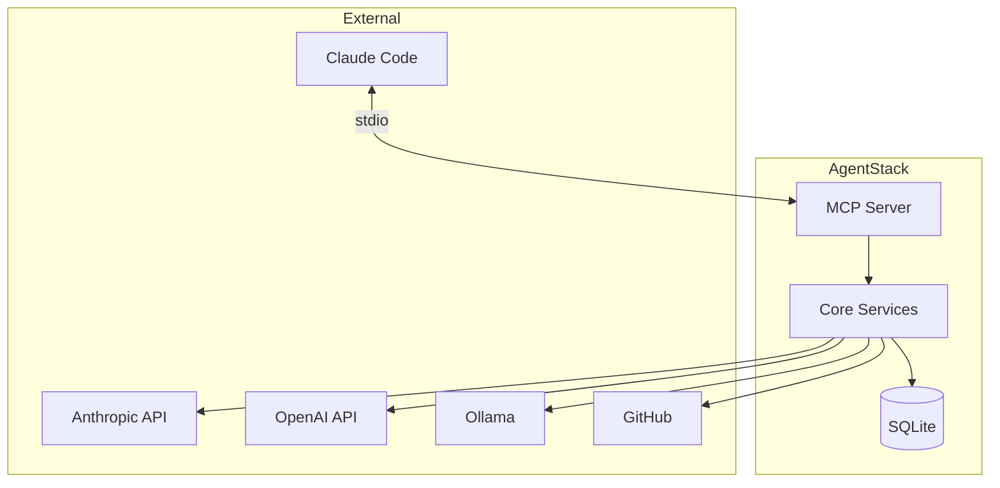
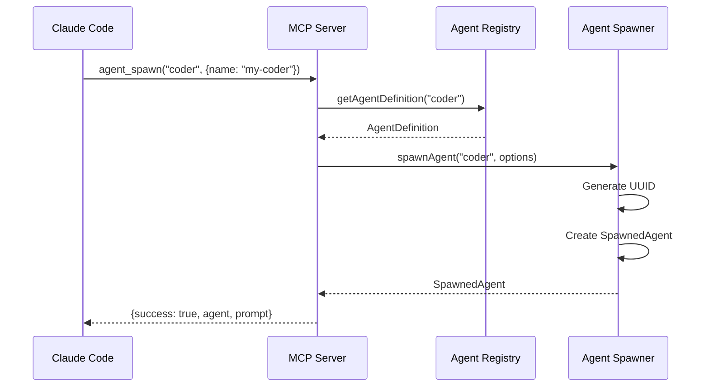
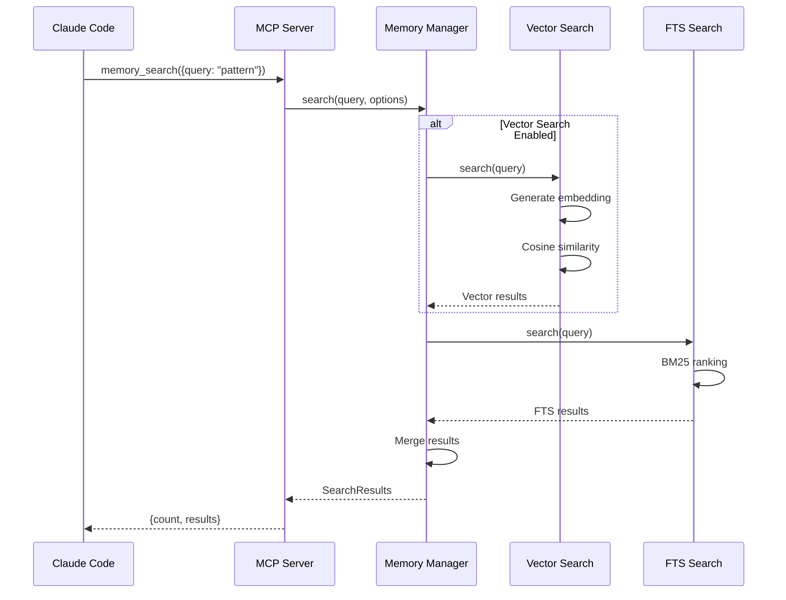
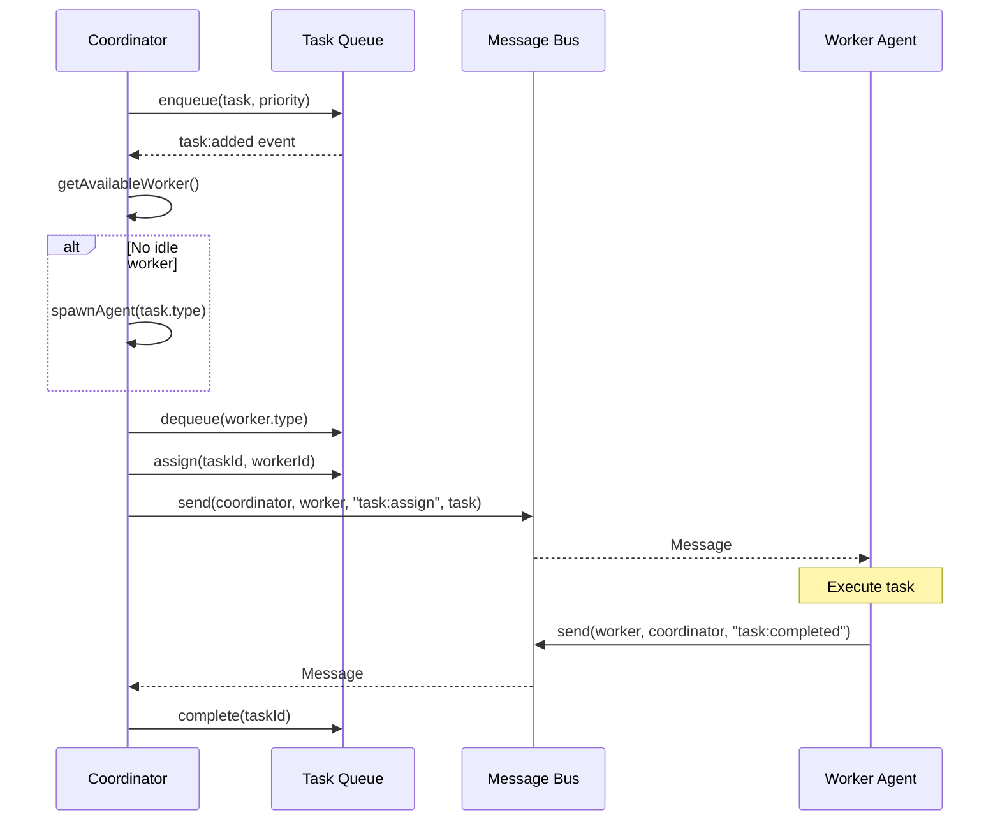
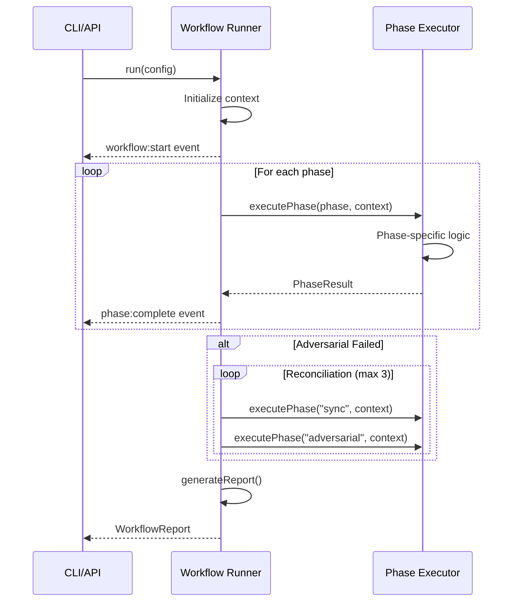

# High-Level Design (HLD)

> System overview, container views, and primary flows

## 1. System Overview

AgentStack is a multi-agent orchestration framework that enables Claude Code to manage specialized AI agents, persistent memory, and complex workflows through the Model Context Protocol (MCP).

### 1.1 System Goals

1. **Agent Management**: Spawn and coordinate specialized agents (coder, tester, reviewer, etc.)
2. **Persistent Memory**: Store and retrieve context with full-text and semantic search
3. **Task Coordination**: Queue, prioritize, and distribute tasks to agents
4. **Workflow Automation**: Execute multi-phase workflows with validation
5. **Extensibility**: Support plugins for custom agents, tools, and hooks

### 1.2 Key Stakeholders

| Stakeholder | Interest |
|-------------|----------|
| Claude Code Users | Access to specialized agents via MCP tools |
| Developers | Programmatic API for agent orchestration |
| Plugin Authors | Extension points for customization |

## 2. System Context



### 2.1 External Dependencies

| System | Protocol | Purpose |
|--------|----------|---------|
| Claude Code | MCP over stdio | Primary client interface |
| Anthropic API | HTTPS | Claude chat completions |
| OpenAI API | HTTPS | Chat and embeddings |
| Ollama | HTTP (localhost) | Local LLM inference |
| GitHub | gh CLI | Issue/PR operations |

## 3. Container Architecture

### 3.1 MCP Server Container

**Responsibility**: Expose all capabilities as MCP tools for Claude Code.

**Components**:
- Request handler for `ListTools` and `CallTool`
- 30 registered tools across 6 categories
- JSON-RPC style response formatting

**Interfaces**:
- Input: MCP protocol messages via stdin
- Output: Tool results via stdout

### 3.2 Agent Manager Container

**Responsibility**: Define, register, and manage agent instances.

**Components**:
- **Registry**: Maps agent types to definitions
- **Spawner**: Creates and tracks active agents
- **Definitions**: 7 built-in agent types

**Agent Types**:

| Type | Capabilities |
|------|--------------|
| coder | write-code, edit-code, refactor, debug |
| tester | write-tests, run-tests, coverage-analysis |
| reviewer | code-review, security-review, best-practices |
| researcher | search-code, analyze-patterns, gather-requirements |
| architect | system-design, technical-decisions, documentation |
| coordinator | task-decomposition, agent-coordination |
| analyst | data-analysis, performance-profiling, metrics |

### 3.3 Memory Manager Container

**Responsibility**: Persist and search key-value data with metadata.

**Components**:
- **SQLiteStore**: Core persistence layer
- **FTSSearch**: BM25-based full-text search
- **VectorSearch**: Optional embedding-based semantic search

**Storage Schema**:
```
memory (key, namespace, content, embedding, metadata)
sessions (id, status, timestamps, metadata)
tasks (id, session_id, agent_type, status, input, output)
```

### 3.4 Coordination Container

**Responsibility**: Manage task execution and inter-agent communication.

**Components**:
- **TaskQueue**: Priority-based task queue with events
- **MessageBus**: Pub/sub for agent-to-agent messages
- **HierarchicalCoordinator**: One coordinator managing workers

### 3.5 Workflow Runner Container

**Responsibility**: Execute multi-phase workflows with validation.

**Phases**:
1. **Inventory**: Discover documents/resources
2. **Analysis**: Analyze current state
3. **Sync**: Apply updates
4. **Consistency**: Verify cross-document consistency
5. **Adversarial**: Red-team validation
6. **Reconciliation**: Fix failures and retry

## 4. Primary Data Flows

### 4.1 Agent Spawn Flow



### 4.2 Memory Search Flow



### 4.3 Task Coordination Flow



### 4.4 Workflow Execution Flow



## 5. Integration Points

### 5.1 MCP Tool Categories

| Category | Tool Count | Purpose |
|----------|------------|---------|
| Agent | 6 | Spawn, list, stop, status |
| Memory | 5 | Store, search, get, list, delete |
| Task | 5 | Create, assign, complete, list, get |
| Session | 4 | Start, end, status, active |
| System | 3 | Status, health, config |
| GitHub | 7 | Issues and PRs |

**Total: 30 tools**

### 5.2 Provider Interface

All LLM providers implement:

```typescript
interface LLMProvider {
  name: string;
  chat(messages: ChatMessage[], options?: ChatOptions): Promise<ChatResponse>;
  embed?(text: string): Promise<number[]>;
}
```

### 5.3 Plugin Interface

Plugins can extend:

```typescript
interface AgentStackPlugin {
  name: string;
  version: string;
  agents?: AgentDefinition[];    // Custom agent types
  tools?: MCPToolDefinition[];    // Additional MCP tools
  hooks?: HookDefinition[];       // Lifecycle hooks
  providers?: ProviderDefinition[]; // Custom LLM providers
  init?(config): Promise<void>;
  cleanup?(): Promise<void>;
}
```

## 6. Cross-Cutting Concerns

### 6.1 Configuration

- JSON config file with environment variable interpolation
- Zod schema validation with defaults
- Singleton pattern for cached access

### 6.2 Logging

- Hierarchical logger with child contexts
- Levels: debug, info, warn, error
- JSON metadata support

### 6.3 Error Handling

- Consistent try-catch patterns
- Graceful degradation for optional features
- Descriptive error messages in MCP responses

### 6.4 State Management

| State | Scope | Persistence |
|-------|-------|-------------|
| Config | Global singleton | File-based |
| Memory | Global singleton | SQLite |
| Agents | Module-level maps | In-memory |
| Tasks | Per-coordinator | In-memory |
| Sessions | Memory Manager | SQLite |

## 7. Non-Functional Requirements

### 7.1 Performance

- Synchronous SQLite operations for reliability
- In-memory agent and task tracking
- Batch embedding support

### 7.2 Scalability

- Configurable max concurrent agents (1-20)
- Priority-based task queue
- Worker pooling in hierarchical coordinator

### 7.3 Reliability

- SQLite transactions for data integrity
- Task requeue on failure
- Graceful shutdown with cleanup

## 8. Related Documents

- [ARCHITECTURE.md](ARCHITECTURE.md) - Architecture diagrams
- [LLD.md](LLD.md) - Detailed component design
- [API.md](API.md) - API reference
- [DATA.md](DATA.md) - Data model details
