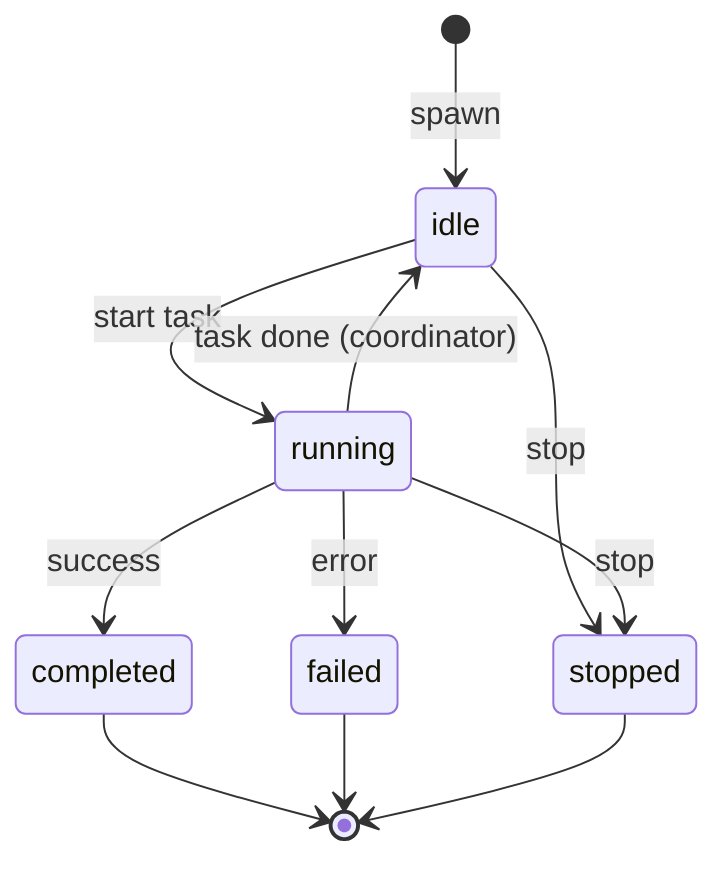
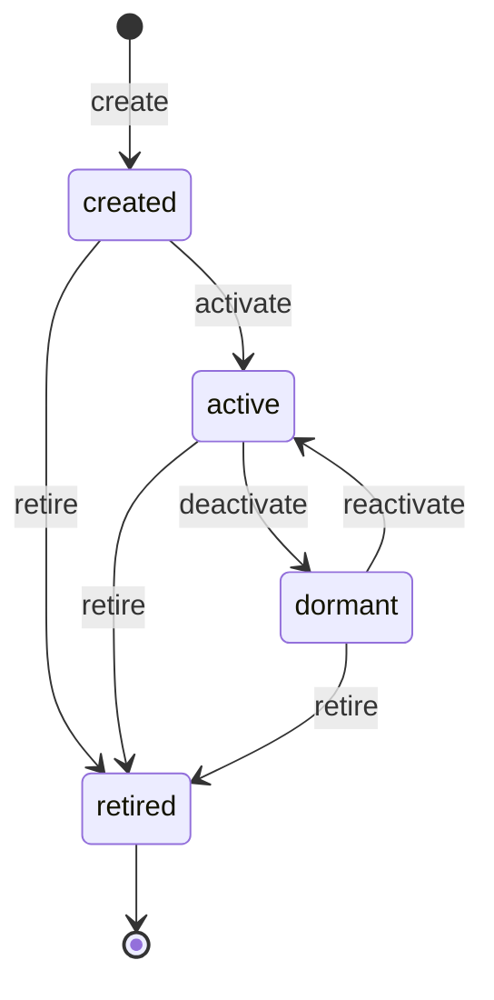
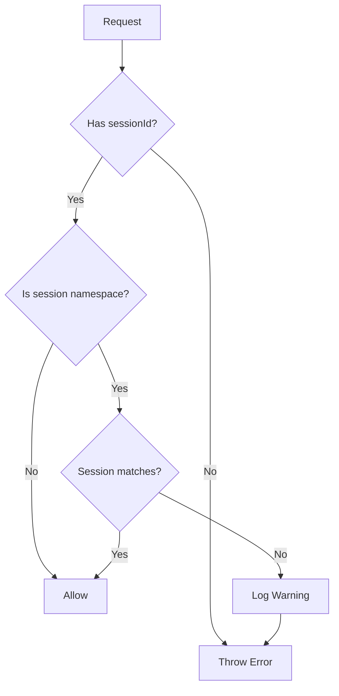
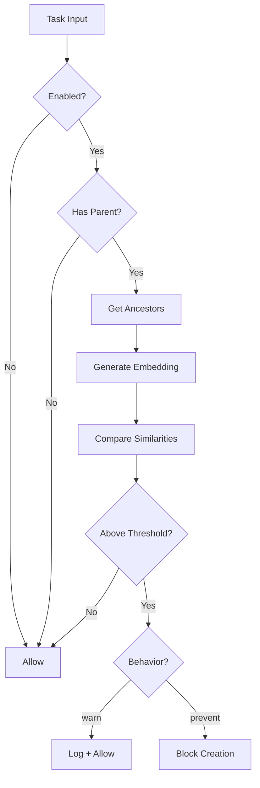
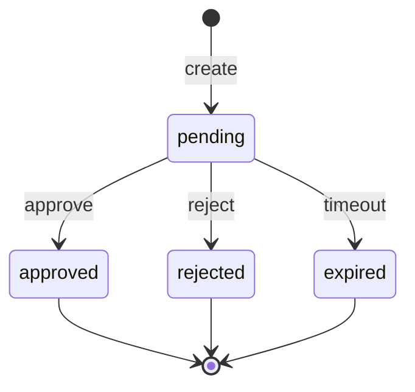
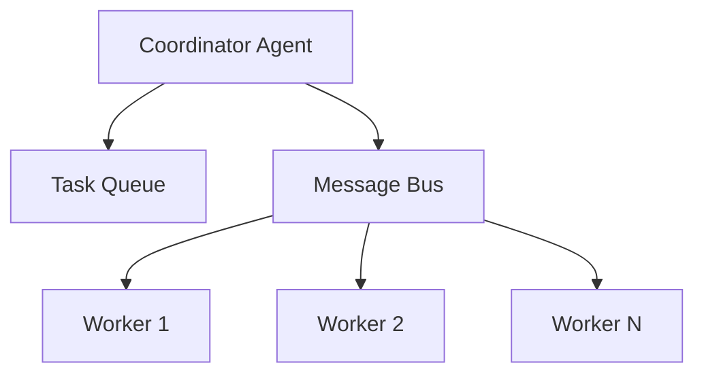

# Low-Level Design (LLD)

> Module breakdowns, component details, and implementation specifications

## 1. Agents Module (`src/agents/`)

### 1.1 Agent Registry (`registry.ts`)

**Purpose**: Maintain a registry of agent type definitions.

**Data Structures**:
```typescript
// Internal storage
const agentRegistry: Map<string, AgentDefinition> = new Map();
const coreAgentTypes: Set<string> = new Set([
  'coder', 'researcher', 'tester', 'reviewer', 'adversarial',
  'architect', 'coordinator', 'analyst', 'devops',
  'documentation', 'security-auditor'
]);
```

**Key Functions**:

| Function | Signature | Description |
|----------|-----------|-------------|
| `getAgentDefinition` | `(type: string) => AgentDefinition \| null` | Retrieve definition by type |
| `listAgentTypes` | `() => string[]` | List all registered types |
| `registerAgent` | `(definition: AgentDefinition) => boolean` | Register custom agent (fails for core types) |
| `unregisterAgent` | `(type: string) => boolean` | Remove custom agent |
| `hasAgentType` | `(type: string) => boolean` | Check if type exists |

**Constraints**:
- Core agent types cannot be overridden
- Custom agents require unique type names

### 1.2 Agent Spawner (`spawner.ts`)

**Purpose**: Create and manage active agent instances.

**Data Structures**:
```typescript
// Active agent tracking
const activeAgents: Map<string, SpawnedAgent> = new Map();
const agentsByName: Map<string, SpawnedAgent> = new Map();
```

**SpawnedAgent Interface**:
```typescript
interface SpawnedAgent {
  id: string;              // UUID v4
  type: AgentType | string;
  name: string;            // User-provided or generated
  status: AgentStatus;     // 'idle' | 'running' | 'completed' | 'failed' | 'stopped'
  createdAt: Date;
  sessionId?: string;
  metadata?: Record<string, unknown>;
}
```

**Key Functions**:

| Function | Description |
|----------|-------------|
| `spawnAgent(type, options?)` | Create new agent instance |
| `getAgent(id)` | Get agent by ID |
| `getAgentByName(name)` | Get agent by name |
| `listAgents(sessionId?)` | List agents, optionally filtered |
| `stopAgent(id)` | Stop agent, set status to 'stopped' |
| `updateAgentStatus(id, status)` | Update agent status |

**Status Transitions**:


### 1.3 Agent Definitions (`definitions/`)

Each agent definition contains:

```typescript
interface AgentDefinition {
  type: AgentType;
  name: string;           // Display name
  description: string;    // Purpose description
  systemPrompt: string;   // LLM instruction (multi-line)
  capabilities: string[]; // Declared abilities
}
```

**Agent System Prompt Structure**:
1. Role definition
2. Key responsibilities (3-5 items)
3. Behavioral guidelines
4. Output expectations

### 1.4 Identity Service (`identity-service.ts`)

**Purpose**: Manage persistent agent identities with lifecycle states.

**Data Structures**:
```typescript
interface AgentIdentity {
  agentId: string;           // UUID v4
  agentType: string;
  status: AgentIdentityStatus;  // 'created' | 'active' | 'dormant' | 'retired'
  capabilities: AgentCapability[];
  version: number;
  displayName?: string;
  description?: string;
  metadata?: Record<string, unknown>;
  createdAt: Date;
  lastActiveAt: Date;
  retiredAt?: Date;
  retirementReason?: string;
  createdBy?: string;
  updatedAt: Date;
}
```

**Status Transitions**:


**Key Functions**:

| Function | Description |
|----------|-------------|
| `createIdentity(opts)` | Create new identity with UUID |
| `getIdentity(id)` | Get by ID |
| `getIdentityByName(name)` | Get by display name |
| `listIdentities(filters)` | List with status/type filters |
| `updateIdentity(id, data, actorId)` | Update metadata/capabilities |
| `activateIdentity(id, actorId)` | Transition to active |
| `deactivateIdentity(id, reason, actorId)` | Transition to dormant |
| `retireIdentity(id, reason, actorId)` | Permanent retirement |
| `getAuditTrail(id, limit)` | Get audit entries |

**Audit Trail**:
Every identity change is logged with:
- `action`: created, activated, deactivated, retired, updated, spawned
- `previousStatus` / `newStatus`
- `reason`
- `actorId` (who made the change)
- `timestamp`

## 2. Memory Module (`src/memory/`)

### 2.1 SQLite Store (`sqlite-store.ts`)

**Purpose**: Core persistence layer with SQLite.

**Database Schema**:
```sql
-- Memory table (with agent scoping support)
CREATE TABLE IF NOT EXISTS memory (
  id TEXT PRIMARY KEY,
  key TEXT NOT NULL,
  namespace TEXT DEFAULT 'default',
  content TEXT NOT NULL,
  embedding BLOB,
  metadata TEXT,
  agent_id TEXT DEFAULT NULL,  -- Agent ownership for scoped memory
  created_at INTEGER NOT NULL,
  updated_at INTEGER NOT NULL,
  UNIQUE(namespace, key)
);

CREATE INDEX IF NOT EXISTS idx_memory_namespace ON memory(namespace);
CREATE INDEX IF NOT EXISTS idx_memory_key ON memory(key);
CREATE INDEX IF NOT EXISTS idx_memory_updated ON memory(updated_at);
CREATE INDEX IF NOT EXISTS idx_memory_agent_id ON memory(agent_id);

-- FTS5 virtual table
CREATE VIRTUAL TABLE IF NOT EXISTS memory_fts USING fts5(
  key, content, namespace,
  content=memory,
  content_rowid=rowid,
  tokenize='porter unicode61'
);

-- Triggers for FTS sync
CREATE TRIGGER memory_ai AFTER INSERT ON memory BEGIN
  INSERT INTO memory_fts(rowid, key, content, namespace)
  VALUES (NEW.rowid, NEW.key, NEW.content, NEW.namespace);
END;

CREATE TRIGGER memory_ad AFTER DELETE ON memory BEGIN
  INSERT INTO memory_fts(memory_fts, rowid, key, content, namespace)
  VALUES('delete', OLD.rowid, OLD.key, OLD.content, OLD.namespace);
END;

CREATE TRIGGER memory_au AFTER UPDATE ON memory BEGIN
  INSERT INTO memory_fts(memory_fts, rowid, key, content, namespace)
  VALUES('delete', OLD.rowid, OLD.key, OLD.content, OLD.namespace);
  INSERT INTO memory_fts(rowid, key, content, namespace)
  VALUES (NEW.rowid, NEW.key, NEW.content, NEW.namespace);
END;

-- Sessions table
CREATE TABLE IF NOT EXISTS sessions (
  id TEXT PRIMARY KEY,
  status TEXT NOT NULL,
  started_at INTEGER NOT NULL,
  ended_at INTEGER,
  metadata TEXT
);

-- Tasks table
CREATE TABLE IF NOT EXISTS tasks (
  id TEXT PRIMARY KEY,
  session_id TEXT REFERENCES sessions(id),
  agent_type TEXT NOT NULL,
  status TEXT NOT NULL,
  input TEXT,
  output TEXT,
  created_at INTEGER NOT NULL,
  completed_at INTEGER
);
```

**Key Operations**:

| Method | SQL Pattern |
|--------|-------------|
| `store(key, content, opts)` | INSERT ... ON CONFLICT DO UPDATE |
| `get(key, namespace)` | SELECT WHERE namespace = ? AND key = ? |
| `delete(key, namespace)` | DELETE WHERE namespace = ? AND key = ? |
| `list(namespace, limit, offset)` | SELECT ... ORDER BY updated_at DESC LIMIT ? OFFSET ? |

### 2.2 FTS Search (`fts-search.ts`)

**Purpose**: Full-text search using SQLite FTS5.

**Query Processing**:
1. Escape FTS special characters: `"`, `'`, `*`, `(`, `)`, `-`, `:`
2. Support phrase matching: `"exact phrase"`
3. Support prefix matching: `term*`

**BM25 Scoring**:
```typescript
// Normalize BM25 score to 0-1 range
const normalizedScore = Math.max(0, Math.min(1, 1 - (rawBm25 / -10)));
```

**Snippet Generation**:
```sql
SELECT snippet(memory_fts, 1, '<mark>', '</mark>', '...', 64) as snippet
FROM memory_fts WHERE memory_fts MATCH ?
```

### 2.3 Vector Search (`vector-search.ts`)

**Purpose**: Semantic search using embeddings.

**Embedding Providers**:

| Provider | Model | Dimensions |
|----------|-------|------------|
| OpenAI | text-embedding-3-small | 1536 |
| OpenAI | text-embedding-3-large | 3072 |
| Ollama | nomic-embed-text | 768 |

**Cosine Similarity**:
```typescript
function cosineSimilarity(a: Float32Array, b: Float32Array): number {
  let dotProduct = 0;
  let normA = 0;
  let normB = 0;

  for (let i = 0; i < a.length; i++) {
    dotProduct += a[i] * b[i];
    normA += a[i] * a[i];
    normB += b[i] * b[i];
  }

  return dotProduct / (Math.sqrt(normA) * Math.sqrt(normB));
}
```

**Search Algorithm**:
1. Generate query embedding
2. Load all entries with embeddings from namespace
3. Calculate cosine similarity for each
4. Filter by threshold (default 0.7)
5. Sort by score descending
6. Return top N results

### 2.4 Memory Manager (`index.ts`)

**Purpose**: Unified interface combining SQLite, FTS, and Vector search.

**Hybrid Search Strategy**:
```typescript
async search(query: string, options: MemorySearchOptions): Promise<MemorySearchResult[]> {
  const results: MemorySearchResult[] = [];

  // Try vector search first if enabled
  if (this.vectorSearch && options.useVector !== false) {
    const vectorResults = await this.vectorSearch.search(query, options);
    results.push(...vectorResults);
  }

  // Fall back to FTS if no vector results
  if (results.length === 0) {
    const ftsResults = this.ftsSearch.search(query, options);
    results.push(...ftsResults);
  }

  // Merge and deduplicate by key
  return this.mergeResults(results, options.limit);
}
```

### 2.5 Access Control (`access-control.ts`)

**Purpose**: Enforce session-based memory isolation to prevent cross-session contamination.

**Data Structures**:
```typescript
interface MemoryAccessContext {
  sessionId: string;        // Required - enforced namespace based on session
  agentId?: string;         // Optional - scoping within session
  includeShared?: boolean;  // Include shared memory (agent_id = NULL), default: true
}
```

**Key Functions**:

| Function | Signature | Description |
|----------|-----------|-------------|
| `getSessionNamespace` | `(sessionId: string) => string` | Returns `session:{sessionId}` namespace |
| `isSessionNamespace` | `(namespace: string) => boolean` | Check if namespace is session-scoped |
| `extractSessionId` | `(namespace: string) => string \| null` | Extract sessionId from namespace |
| `validateAccess` | `(context, namespace, operation) => void` | Throws if cross-session access attempted |
| `canAccessEntry` | `(context, entryNamespace, entryAgentId?) => boolean` | Non-throwing access check |
| `deriveNamespace` | `(context, explicitNamespace?) => string` | Get namespace for operation |

**Access Validation Flow**:


**Session Cleanup**:
- On session end, `deleteByNamespace(session:{sessionId})` is called
- All memory entries in the session namespace are deleted
- Cascades to related tables (versions, tags, relationships)

## 3. MCP Module (`src/mcp/`)

### 3.1 MCP Server (`server.ts`)

**Purpose**: Implement MCP protocol for Claude Code.

**Server Initialization**:
```typescript
this.server = new Server(
  { name: 'agentstack', version: config.version },
  { capabilities: { tools: {} } }
);
```

**Request Handlers**:

| Schema | Handler |
|--------|---------|
| `ListToolsRequestSchema` | Return all registered tools |
| `CallToolRequestSchema` | Execute tool by name with arguments |

**Tool Registration**:
```typescript
interface MCPTool {
  name: string;
  description: string;
  inputSchema: Record<string, unknown>;  // JSON Schema
  handler: (params: Record<string, unknown>) => Promise<unknown>;
}
```

### 3.2 Tool Implementations (`tools/`)

**Agent Tools** (`agent-tools.ts`):
- `agent_spawn`: Create agent with type and optional name
- `agent_list`: List agents with optional session filter
- `agent_stop`: Stop by ID or name
- `agent_status`: Get details and capabilities
- `agent_types`: List available types
- `agent_update_status`: Change status

**Memory Tools** (`memory-tools.ts`):
- `memory_store`: Store with key, content, namespace, metadata, agentId (agent-scoped)
- `memory_search`: Hybrid FTS + vector search with agentId filter and includeShared option
- `memory_get`: Retrieve by key
- `memory_list`: Paginated listing with agent filtering
- `memory_delete`: Remove entry

**Task Tools** (`task-tools.ts`):
- `task_create`: Create task with optional drift detection (parentTaskId parameter)
- `task_assign`: Assign to specific agent
- `task_complete`: Mark complete with output
- `task_list`: Filter by session/status
- `task_get`: Get task details
- `task_check_drift`: Check if input would trigger drift detection
- `task_get_relationships`: Get task parent/child relationships
- `task_drift_metrics`: Get drift detection statistics

**Session Tools** (`session-tools.ts`):
- `session_start`: Create with optional metadata
- `session_end`: End active session
- `session_status`: Get session info
- `session_active`: Get current active

**System Tools** (`system-tools.ts`):
- `system_status`: Queue/agent/memory stats
- `system_health`: Diagnostics check
- `system_config`: Current configuration

**GitHub Tools** (`github-tools.ts`):
- `github_issue_create`: Create issue
- `github_issue_list`: List with filters
- `github_issue_get`: Get issue details
- `github_pr_create`: Create pull request
- `github_pr_list`: List PRs
- `github_pr_get`: Get PR details
- `github_repo_info`: Repository info

**Identity Tools** (`identity-tools.ts`):
- `identity_create`: Create new persistent identity
- `identity_get`: Get by ID or display name
- `identity_list`: List with filters
- `identity_update`: Update metadata/capabilities
- `identity_activate`: Transition to active
- `identity_deactivate`: Transition to dormant
- `identity_retire`: Permanent retirement
- `identity_audit`: Get audit trail

**Review Loop Tools** (`review-loop-tools.ts`):
> Note: These tools are exported but not registered in the MCP server. Use the programmatic API for review loops.

- `review_loop_start`: Start adversarial review loop
- `review_loop_status`: Get loop status and details
- `review_loop_abort`: Stop running review loop
- `review_loop_issues`: Get detailed issues from reviews
- `review_loop_list`: List all active review loops
- `review_loop_get_code`: Get current code from loop

## 4. Tasks Module (`src/tasks/`)

### 4.1 Drift Detection Service (`drift-detection-service.ts`)

**Purpose**: Detect semantic drift when creating tasks by comparing against ancestor tasks.

**Configuration**:
```typescript
interface DriftDetectionConfig {
  enabled: boolean;           // default: false
  threshold: number;          // default: 0.95 (block/warn threshold)
  warningThreshold?: number;  // optional lower threshold
  ancestorDepth: number;      // default: 3
  behavior: 'warn' | 'prevent';
  asyncEmbedding: boolean;    // default: true
}
```

**Key Functions**:

| Function | Description |
|----------|-------------|
| `checkDrift(input, type, parentId)` | Check task against ancestors |
| `indexTask(taskId, input)` | Generate and store embedding |
| `createTaskRelationship(from, to, type)` | Create parent/child link |
| `getTaskAncestors(taskId, depth)` | Traverse task tree |
| `getTaskRelationships(taskId, direction)` | Get relationships |
| `getDriftDetectionMetrics(since)` | Get statistics |
| `getRecentDriftEvents(limit)` | Get recent events |

**Drift Check Flow**:


**Relationship Types**:
- `parent_of`: Direct parent-child relationship
- `derived_from`: Task based on another task
- `depends_on`: Dependency relationship
- `supersedes`: Task replaces another

**Database Tables**:
```sql
-- Task embeddings
CREATE TABLE task_embeddings (
  task_id TEXT PRIMARY KEY,
  embedding BLOB NOT NULL,
  model TEXT NOT NULL,
  dimensions INTEGER NOT NULL,
  created_at INTEGER NOT NULL
);

-- Task relationships
CREATE TABLE task_relationships (
  id TEXT PRIMARY KEY,
  from_task_id TEXT NOT NULL,
  to_task_id TEXT NOT NULL,
  relationship_type TEXT NOT NULL,
  metadata TEXT,
  created_at INTEGER NOT NULL,
  UNIQUE(from_task_id, to_task_id, relationship_type)
);

-- Drift events log
CREATE TABLE drift_detection_events (
  id TEXT PRIMARY KEY,
  task_id TEXT,
  task_type TEXT NOT NULL,
  ancestor_task_id TEXT NOT NULL,
  similarity_score REAL NOT NULL,
  threshold REAL NOT NULL,
  action_taken TEXT NOT NULL,
  task_input TEXT,
  created_at INTEGER NOT NULL
);
```

### 4.2 Consensus Service (`consensus-service.ts`)

**Purpose**: Manage consensus checkpoints for high-risk task validation.

**Configuration**:
```typescript
interface ConsensusConfig {
  enabled: boolean;                    // default: false
  requireForRiskLevels: TaskRiskLevel[]; // default: ['high', 'medium']
  reviewerStrategy: ReviewerStrategy;  // default: 'adversarial'
  timeout: number;                     // default: 300000 (5 min)
  maxDepth: number;                    // default: 5
  autoReject: boolean;                 // default: false
  // Risk estimation configuration
  highRiskAgentTypes?: string[];       // default: ['coder', 'devops', 'security-auditor']
  mediumRiskAgentTypes?: string[];     // default: ['architect', 'coordinator', 'analyst']
  highRiskPatterns?: string[];         // default: ['delete', 'remove', 'drop', 'deploy', 'production', ...]
  mediumRiskPatterns?: string[];       // default: ['modify', 'update', 'change', 'configure', 'install']
}
```

**Key Functions**:

| Function | Description |
|----------|-------------|
| `checkConsensusRequired(agentType, input, parentTaskId, riskLevel)` | Check if consensus is needed |
| `createCheckpoint(taskId, subtasks, riskLevel, parentTaskId)` | Create pending checkpoint |
| `getCheckpoint(checkpointId)` | Get checkpoint by ID |
| `listPendingCheckpoints(limit, offset)` | List checkpoints awaiting review |
| `approveCheckpoint(checkpointId, reviewerId, feedback)` | Approve and allow subtasks |
| `rejectCheckpoint(checkpointId, reviewerId, feedback, rejectedIds)` | Reject with feedback |
| `estimateRiskLevel(agentType, input)` | Estimate task risk from type and content |
| `expireCheckpoints()` | Mark expired checkpoints |

**Checkpoint Status Lifecycle**:


**Risk Estimation Algorithm**:
1. Check if `agentType` is in `highRiskAgentTypes` → return 'high'
2. Check if `agentType` is in `mediumRiskAgentTypes` → return 'medium'
3. If `input` provided, scan for `highRiskPatterns` → return 'high' on match
4. If `input` provided, scan for `mediumRiskPatterns` → return 'medium' on match
5. Default → return 'low'

**Integration Points**:
- Task creation checks consensus before spawning subtasks
- MCP tools: `consensus_check`, `consensus_list_pending`, `consensus_get`, `consensus_approve`, `consensus_reject`
- REST API: `/api/v1/consensus/*` endpoints

## 5. Coordination Module (`src/coordination/`)

### 4.1 Task Queue (`task-queue.ts`)

**Purpose**: Priority-based task queueing.

**Data Structures**:
```typescript
interface QueuedTask {
  task: Task;
  priority: number;      // 1-10, higher = more important
  addedAt: Date;
}

// Internal storage
private pending: QueuedTask[] = [];           // Sorted by priority
private processing: Map<string, QueuedTask> = new Map();
```

**Operations**:

| Method | Complexity | Description |
|--------|------------|-------------|
| `enqueue(task, priority)` | O(n) | Insert maintaining sort order |
| `dequeue(agentType?)` | O(n) | Remove first matching task |
| `assign(taskId, agentId)` | O(1) | Move to processing |
| `complete(taskId)` | O(1) | Remove from processing |
| `requeue(taskId)` | O(n) | Move back with lower priority |

**Events**:
- `task:added` - Task enqueued
- `task:assigned` - Task assigned to agent
- `task:completed` - Task finished
- `queue:empty` - No pending tasks

### 4.4 Workflow Runner Events

| Event | Payload | Description |
|-------|---------|-------------|
| `workflow:start` | `WorkflowConfig` | Workflow execution begins |
| `workflow:complete` | `WorkflowReport` | Workflow finished successfully |
| `workflow:error` | `Error` | Workflow failed with error |
| `phase:start` | `WorkflowPhase` | Phase execution begins |
| `phase:complete` | `PhaseResult` | Phase finished |
| `finding` | `Finding` | Issue discovered during phase |

### 4.2 Message Bus (`message-bus.ts`)

**Purpose**: Inter-agent communication.

**Message Structure**:
```typescript
interface Message {
  id: string;           // msg-N counter
  from: string;         // Sender agent ID
  to?: string;          // Recipient (undefined = broadcast)
  type: string;         // Message type
  payload: unknown;     // Message data
  timestamp: Date;
}
```

**Operations**:
- `send(from, to, type, payload)` - Direct message
- `broadcast(from, type, payload)` - To all subscribers
- `subscribe(agentId, callback)` - Per-agent subscription
- `subscribeAll(callback)` - Global listener

### 4.3 Hierarchical Coordinator (`topology.ts`)

**Purpose**: One coordinator managing multiple workers.

**Architecture**:


**Lifecycle**:
1. `initialize()` - Spawn coordinator, subscribe to bus
2. `submitTask(task, priority)` - Add to queue
3. `assignPendingTasks()` - Match tasks to workers
4. Handle `task:completed` / `task:failed` messages
5. `shutdown()` - Stop all agents, clear queue

**Worker Management**:
- Spawn on demand (up to maxWorkers)
- Reuse idle workers
- Worker type matches task agent type

## 5. Workflows Module (`src/workflows/`)

### 5.1 Workflow Runner (`runner.ts`)

**Purpose**: Execute multi-phase workflows.

**Workflow Context**:
```typescript
interface WorkflowContext {
  config: WorkflowConfig;
  currentPhase: WorkflowPhase;
  iteration: number;
  results: PhaseResult[];
  inventory: DocumentInfo[];
  startedAt: Date;
  verdict?: Verdict;
}
```

**Phase Execution**:
```typescript
private async executePhase(phase: WorkflowPhase, context: WorkflowContext): Promise<PhaseResult> {
  const executor = this.phaseExecutors.get(phase);
  if (!executor) {
    return { phase, success: true, findings: [], artifacts: {}, duration: 0 };
  }

  this.emit('phase:start', phase);
  const startTime = Date.now();
  const result = await executor(context);
  result.duration = Date.now() - startTime;

  for (const finding of result.findings) {
    this.emit('finding', finding);
  }

  this.emit('phase:complete', result);
  return result;
}
```

**Reconciliation Loop**:
```
IF adversarial phase FAILS:
  WHILE iteration < maxIterations AND verdict == 'FAIL':
    iteration++
    Run sync phase
    Run adversarial phase
    IF adversarial passes: verdict = 'PASS'
```

### 5.2 Workflow Types (`types.ts`)

**Phases**:
```typescript
type WorkflowPhase =
  | 'inventory'     // Discover resources
  | 'analysis'      // Analyze state
  | 'sync'          // Apply updates
  | 'consistency'   // Cross-check
  | 'adversarial'   // Red-team validation
  | 'reconciliation'; // Fix and retry
```

**Finding**:
```typescript
interface Finding {
  claim: string;           // What was asserted
  contradiction: string;   // What contradicted it
  severity: 'low' | 'medium' | 'high';
  evidence: string[];
  file?: string;
  line?: number;
}
```

**Report**:
```typescript
interface WorkflowReport {
  id: string;
  workflow: string;
  startedAt: Date;
  completedAt: Date;
  duration: number;
  verdict: 'PASS' | 'FAIL';
  phases: PhaseResult[];
  summary: {
    documentsScanned: number;
    documentsUpdated: number;
    sectionsRemoved: number;
    sectionsAdded: number;
    diagramsUpdated: number;
    findingsTotal: number;
    findingsBySeverity: { low: number; medium: number; high: number };
  };
  confidence: string;
}
```

## 6. Plugins Module (`src/plugins/`)

### 6.1 Plugin Loader (`loader.ts`)

**Loading Process**:
1. Dynamic import ES module
2. Validate required fields (name, version)
3. Call `init(config)` if defined
4. Register agents in agent registry

**Discovery**:
```typescript
async function discoverPlugins(config: AgentStackConfig): Promise<number> {
  const pluginDir = config.plugins.directory;
  // Scan for package.json files
  // Load package.module or package.main
  // Return count of loaded plugins
}
```

### 6.2 Plugin Registry (`registry.ts`)

**Storage**:
```typescript
interface PluginEntry {
  plugin: AgentStackPlugin;
  enabled: boolean;
  config: Record<string, unknown>;
}

const plugins: Map<string, PluginEntry> = new Map();
```

## 7. Hooks Module (`src/hooks/`)

### 7.1 Hook System (`index.ts`)

**Events**:
```typescript
type HookEvent =
  | 'session-start'
  | 'session-end'
  | 'pre-task'
  | 'post-task'
  | 'workflow';
```

**Execution**:
```typescript
async function executeHooks(
  event: HookEvent,
  context: HookContext,
  memory: MemoryManager,
  config: AgentStackConfig
): Promise<void> {
  // Check if hook enabled in config
  // Call built-in handler
  // Call custom handlers
  // Catch and log errors
}
```

### 7.2 Workflow Triggers (`workflow.ts`)

**Trigger Interface**:
```typescript
interface WorkflowTrigger {
  id: string;
  name: string;
  condition: (context: HookContext) => boolean;
  workflowId: string;
  options?: Record<string, unknown>;
}
```

> **Note**: Triggers are evaluated within the 'workflow' hook event context. The `condition` function determines if the workflow should be triggered based on the hook context.

## 8. Providers Module (`src/providers/`)

### 8.1 Provider Interface

```typescript
interface LLMProvider {
  name: string;
  chat(messages: ChatMessage[], options?: ChatOptions): Promise<ChatResponse>;
  embed?(text: string): Promise<number[]>;
}
```

### 8.2 Implementations

**AnthropicProvider**:
- Model: claude-sonnet-4-20250514
- SDK: @anthropic-ai/sdk
- Features: chat only (no embeddings in this implementation)

**OpenAIProvider**:
- Model: gpt-4o (chat), text-embedding-3-small (embed)
- SDK: openai
- Features: chat, embeddings

**OllamaProvider**:
- Model: llama3.2 (chat), nomic-embed-text (embed)
- API: HTTP to localhost:11434
- Features: chat, embeddings (local)

> **Note**: For vector search embeddings, use OpenAI or Ollama providers. AnthropicProvider does not implement the `embed()` method.

### 8.3 CLI-Based Providers (`cli-providers.ts`)

AgentStack includes three CLI-based providers for executing tasks through external CLI tools:

**ClaudeCodeProvider**:
- Name: `'claude-code'`
- Default model: `'sonnet'`
- CLI command: `claude --print`
- Requires: `npm install -g @anthropic-ai/claude-code`
- Features: chat only (no embeddings)

**GeminiCLIProvider**:
- Name: `'gemini-cli'`
- Default model: `'gemini-2.0-flash'`
- CLI command: `gemini`
- Requires: `pip install google-generativeai`
- Features: chat only (no embeddings)

**CodexProvider**:
- Name: `'codex'`
- CLI command: `codex exec`
- Requires: Codex CLI installed
- Features: chat only (no embeddings)

**Configuration**:
```json
{
  "providers": {
    "default": "claude-code",
    "claude_code": {
      "command": "claude",
      "model": "sonnet",
      "timeout": 300000
    },
    "gemini_cli": {
      "command": "gemini",
      "model": "gemini-2.0-flash",
      "timeout": 120000
    },
    "codex": {
      "command": "codex",
      "timeout": 300000
    }
  }
}
```

**Helper Function**:
```typescript
// Check availability of CLI providers
const availability = checkCLIProviders();
// Returns: { 'claude-code': boolean, 'gemini-cli': boolean, 'codex': boolean }
```

## 9. CLI Module (`src/cli/`)

### 9.1 Agent Watch Command (`cli/commands/agent-watch.ts`)

**Purpose**: Real-time monitoring of agent activity

**Key Types**:
```typescript
interface AgentWatchOptions {
  interval: string;      // Refresh interval in seconds
  session?: string;      // Optional session filter
  type?: string;         // Optional agent type filter
  status?: string;       // Optional status filter (idle/running/completed/failed/stopped)
  json: boolean;         // JSON snapshot mode
  clear: boolean;        // Clear screen between refreshes
}

interface AgentWatchData {
  agents: SpawnedAgent[];
  stats: {
    active: number;
    maxConcurrent: number;
    byStatus: Record<AgentStatus, number>;
  };
}
```

**Key Functions**:

| Function | Signature | Description |
|----------|-----------|-------------|
| `runAgentWatch` | `(options: AgentWatchOptions, config: AgentStackConfig) => Promise<void>` | Main entry point for watch command |
| `collectAgentData` | `(options: AgentWatchOptions) => AgentWatchData` | Fetch and filter agent data |
| `countByStatus` | `(agents: SpawnedAgent[]) => Record<AgentStatus, number>` | Calculate status distribution |

**Execution Flow**:
1. Parse interval (validate >= 1 second)
2. If `--json`: collect data, output once, exit
3. Interactive mode: hide cursor, initial render
4. Set up refresh interval with cleanup handlers (SIGINT/SIGTERM)
5. On each tick: collect data, render via `WatchRenderer`
6. On exit: show cursor, preserve output, print "Watch stopped."

**Dependencies**:
- `WatchRenderer` class from `cli/utils/watch-renderer.ts` (table formatting)
- Terminal utilities from `cli/utils/terminal.ts` (cursor, clear screen)
- Agent functions: `listAgents()`, `getConcurrencyStats()` from `agents/spawner.ts`

**File References**:
- Implementation: `/src/cli/commands/agent-watch.ts`
- Integration: `/src/cli/commands/agent.ts:183-195`
- Renderer: `/src/cli/utils/watch-renderer.ts`
- Terminal: `/src/cli/utils/terminal.ts`

### 9.2 Terminal Utilities (`cli/utils/terminal.ts`)

**Purpose**: ANSI escape code utilities for terminal control

**Key Functions**:

| Function | Signature | Description |
|----------|-----------|-------------|
| `hideCursor` | `() => void` | Hide terminal cursor (ANSI: `\x1b[?25l`) |
| `showCursor` | `() => void` | Show terminal cursor (ANSI: `\x1b[?25h`) |
| `clearScreen` | `() => void` | Clear screen and move cursor to top-left |
| `statusIcon` | `(status: AgentStatus) => string` | Get Unicode icon for status |
| `statusColor` | `(status: AgentStatus) => string` | Get ANSI color code for status |
| `statusLabel` | `(status: AgentStatus) => string` | Get short label for status |
| `formatDuration` | `(ms: number) => string` | Format milliseconds to human-readable duration |
| `truncate` | `(text: string, maxLen: number) => string` | Truncate text with ellipsis |

### 9.3 Watch Renderer (`cli/utils/watch-renderer.ts`)

**Purpose**: Render agent watch display with table formatting

**Key Class**: `WatchRenderer`

**Constructor Options**:
```typescript
interface WatchRendererOptions {
  clearScreen: boolean;  // Whether to clear screen before each render
}
```

**Key Method**:
- `render(data: AgentWatchData): void` - Render table with agents and stats

**Rendering Logic**:
1. Optionally clear screen
2. Print header with timestamp and title
3. Print summary with active/max concurrent counts and status breakdown
4. Print table header (STATUS, NAME, TYPE, UPTIME, TASK)
5. Print separator line
6. Print agent rows (sorted: running first, then by creation time)
7. Print footer with exit instruction

**Display Features**:
- Unicode characters for borders and status icons
- ANSI colors for status indication
- Text truncation to fit display width
- Relative timestamps (e.g., "2m 15s")
- Dynamic task descriptions from agent metadata

## 10. Utils Module (`src/utils/`)

### 10.1 Configuration (`config.ts`)

**Schema Validation**:
- Zod schemas for all config sections
- Environment variable interpolation: `${VAR_NAME}`
- Defaults applied for missing fields

**Config Resolution**:
1. Find `aistack.config.json` by walking up directories
2. Parse JSON
3. Interpolate env vars
4. Validate with Zod
5. Cache singleton

### 10.2 Logger (`logger.ts`)

**Features**:
- Hierarchical with `child(prefix)` method
- Levels: debug, info, warn, error
- JSON metadata support
- TTY color detection

### 10.3 Embeddings (`embeddings.ts`)

**Provider Factory**:
```typescript
function createEmbeddingProvider(config: AgentStackConfig): EmbeddingProvider | null {
  // Check vectorSearch config
  // Return OpenAI or Ollama embedder
  // Return null if not configured
}
```

## 11. Monitoring Module (`src/monitoring/`)

### 11.1 Resource Exhaustion Service (`resource-exhaustion-service.ts`)

**Purpose**: Track and prevent runaway agents consuming excessive resources.

**Data Structures**:
```typescript
interface AgentResourceMetrics {
  agentId: string;
  filesRead: number;
  filesWritten: number;
  filesModified: number;
  apiCallsCount: number;
  subtasksSpawned: number;
  tokensConsumed: number;
  startedAt: Date;
  lastDeliverableAt: Date | null;
  lastActivityAt: Date;
  phase: ResourceExhaustionPhase;  // 'normal' | 'warning' | 'intervention' | 'termination'
  pausedAt: Date | null;
  pauseReason: string | null;
}
```

**Key Functions**:

| Function | Description |
|----------|-------------|
| `initializeAgent(agentId, type)` | Start tracking a new agent |
| `recordFileOperation(agentId, op)` | Record file read/write/modify |
| `recordApiCall(agentId, tokens?)` | Record API call and token usage |
| `recordSubtaskSpawn(agentId)` | Record subtask spawn |
| `recordDeliverable(agentId, type, desc?)` | Record deliverable checkpoint |
| `evaluateAgent(agentId)` | Evaluate current phase based on thresholds |
| `pauseAgent(agentId, reason)` | Pause agent execution |
| `resumeAgent(agentId)` | Resume paused agent |

**Phase Progression**:
```
normal → warning → intervention → termination
```

**Thresholds** (configurable):
- `maxFilesAccessed`: 50 (default)
- `maxApiCalls`: 100 (default)
- `maxSubtasksSpawned`: 20 (default)
- `maxTimeWithoutDeliverableMs`: 1800000 (30 min)
- `maxTokensConsumed`: 500000 (default)

### 11.2 Metrics Collector (`metrics.ts`)

**Prometheus Metrics**:
- Counters: warnings, interventions, terminations
- Gauges: paused agents count
- Histograms: files accessed, API calls, tokens consumed

### 11.3 Health Monitor (`health.ts`)

**Health Check Types**:
- Liveness probe (`/api/v1/system/health/live`)
- Readiness probe (`/api/v1/system/health/ready`)
- Detailed health (`/api/v1/system/health/detailed`)

## 12. Related Documents

- [ARCHITECTURE.md](ARCHITECTURE.md) - System diagrams
- [HLD.md](HLD.md) - High-level design
- [API.md](API.md) - API reference
- [DATA.md](DATA.md) - Data models
