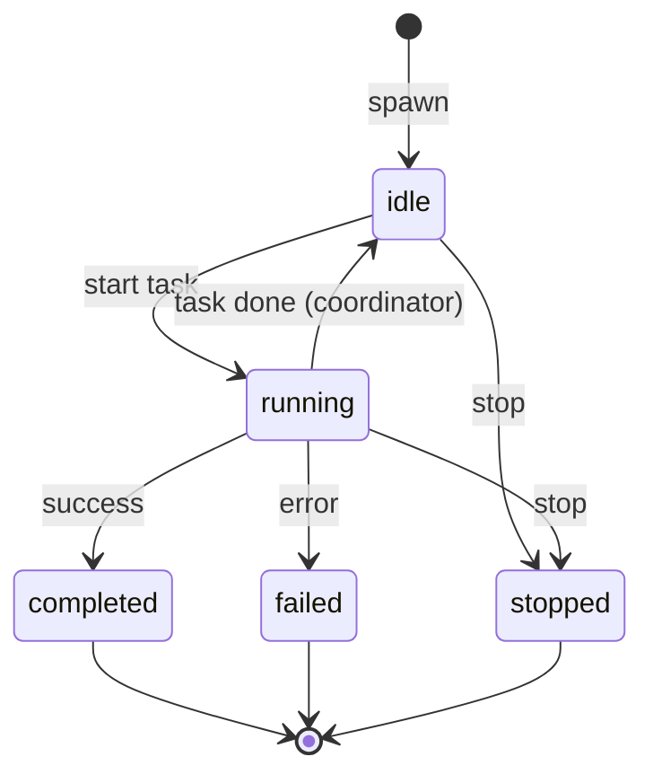
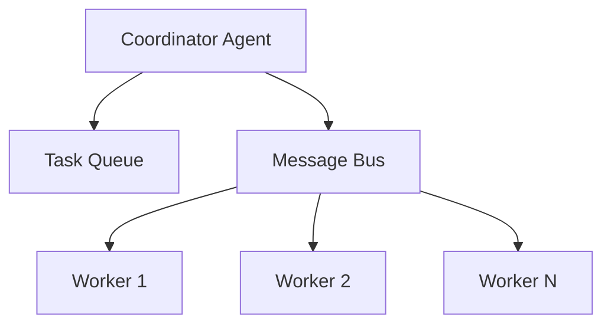

# Low-Level Design (LLD)

> Module breakdowns, component details, and implementation specifications

## 1. Agents Module (`src/agents/`)

### 1.1 Agent Registry (`registry.ts`)

**Purpose**: Maintain a registry of agent type definitions.

**Data Structures**:
```typescript
// Internal storage
const agentRegistry: Map<string, AgentDefinition> = new Map();
const coreAgentTypes: Set<string> = new Set([
  'coder', 'researcher', 'tester', 'reviewer',
  'architect', 'coordinator', 'analyst'
]);
```

**Key Functions**:

| Function | Signature | Description |
|----------|-----------|-------------|
| `getAgentDefinition` | `(type: string) => AgentDefinition \| null` | Retrieve definition by type |
| `listAgentTypes` | `() => string[]` | List all registered types |
| `registerAgent` | `(definition: AgentDefinition) => boolean` | Register custom agent (fails for core types) |
| `unregisterAgent` | `(type: string) => boolean` | Remove custom agent |
| `hasAgentType` | `(type: string) => boolean` | Check if type exists |

**Constraints**:
- Core agent types cannot be overridden
- Custom agents require unique type names

### 1.2 Agent Spawner (`spawner.ts`)

**Purpose**: Create and manage active agent instances.

**Data Structures**:
```typescript
// Active agent tracking
const activeAgents: Map<string, SpawnedAgent> = new Map();
const agentsByName: Map<string, SpawnedAgent> = new Map();
```

**SpawnedAgent Interface**:
```typescript
interface SpawnedAgent {
  id: string;              // UUID v4
  type: AgentType | string;
  name: string;            // User-provided or generated
  status: AgentStatus;     // 'idle' | 'running' | 'completed' | 'failed' | 'stopped'
  createdAt: Date;
  sessionId?: string;
  metadata?: Record<string, unknown>;
}
```

**Key Functions**:

| Function | Description |
|----------|-------------|
| `spawnAgent(type, options?)` | Create new agent instance |
| `getAgent(id)` | Get agent by ID |
| `getAgentByName(name)` | Get agent by name |
| `listAgents(sessionId?)` | List agents, optionally filtered |
| `stopAgent(id)` | Stop agent, set status to 'stopped' |
| `updateAgentStatus(id, status)` | Update agent status |

**Status Transitions**:


### 1.3 Agent Definitions (`definitions/`)

Each agent definition contains:

```typescript
interface AgentDefinition {
  type: AgentType;
  name: string;           // Display name
  description: string;    // Purpose description
  systemPrompt: string;   // LLM instruction (multi-line)
  capabilities: string[]; // Declared abilities
}
```

**Agent System Prompt Structure**:
1. Role definition
2. Key responsibilities (3-5 items)
3. Behavioral guidelines
4. Output expectations

## 2. Memory Module (`src/memory/`)

### 2.1 SQLite Store (`sqlite-store.ts`)

**Purpose**: Core persistence layer with SQLite.

**Database Schema**:
```sql
-- Memory table
CREATE TABLE IF NOT EXISTS memory (
  id TEXT PRIMARY KEY,
  key TEXT NOT NULL,
  namespace TEXT DEFAULT 'default',
  content TEXT NOT NULL,
  embedding BLOB,
  metadata TEXT,
  created_at INTEGER NOT NULL,
  updated_at INTEGER NOT NULL,
  UNIQUE(namespace, key)
);

CREATE INDEX IF NOT EXISTS idx_memory_namespace ON memory(namespace);
CREATE INDEX IF NOT EXISTS idx_memory_key ON memory(key);
CREATE INDEX IF NOT EXISTS idx_memory_updated ON memory(updated_at);

-- FTS5 virtual table
CREATE VIRTUAL TABLE IF NOT EXISTS memory_fts USING fts5(
  key, content, namespace,
  content=memory,
  content_rowid=rowid,
  tokenize='porter unicode61'
);

-- Triggers for FTS sync
CREATE TRIGGER memory_ai AFTER INSERT ON memory BEGIN
  INSERT INTO memory_fts(rowid, key, content, namespace)
  VALUES (NEW.rowid, NEW.key, NEW.content, NEW.namespace);
END;

CREATE TRIGGER memory_ad AFTER DELETE ON memory BEGIN
  INSERT INTO memory_fts(memory_fts, rowid, key, content, namespace)
  VALUES('delete', OLD.rowid, OLD.key, OLD.content, OLD.namespace);
END;

CREATE TRIGGER memory_au AFTER UPDATE ON memory BEGIN
  INSERT INTO memory_fts(memory_fts, rowid, key, content, namespace)
  VALUES('delete', OLD.rowid, OLD.key, OLD.content, OLD.namespace);
  INSERT INTO memory_fts(rowid, key, content, namespace)
  VALUES (NEW.rowid, NEW.key, NEW.content, NEW.namespace);
END;

-- Sessions table
CREATE TABLE IF NOT EXISTS sessions (
  id TEXT PRIMARY KEY,
  status TEXT NOT NULL,
  started_at INTEGER NOT NULL,
  ended_at INTEGER,
  metadata TEXT
);

-- Tasks table
CREATE TABLE IF NOT EXISTS tasks (
  id TEXT PRIMARY KEY,
  session_id TEXT REFERENCES sessions(id),
  agent_type TEXT NOT NULL,
  status TEXT NOT NULL,
  input TEXT,
  output TEXT,
  created_at INTEGER NOT NULL,
  completed_at INTEGER
);
```

**Key Operations**:

| Method | SQL Pattern |
|--------|-------------|
| `store(key, content, opts)` | INSERT ... ON CONFLICT DO UPDATE |
| `get(key, namespace)` | SELECT WHERE namespace = ? AND key = ? |
| `delete(key, namespace)` | DELETE WHERE namespace = ? AND key = ? |
| `list(namespace, limit, offset)` | SELECT ... ORDER BY updated_at DESC LIMIT ? OFFSET ? |

### 2.2 FTS Search (`fts-search.ts`)

**Purpose**: Full-text search using SQLite FTS5.

**Query Processing**:
1. Escape FTS special characters: `"`, `'`, `*`, `(`, `)`, `-`, `:`
2. Support phrase matching: `"exact phrase"`
3. Support prefix matching: `term*`

**BM25 Scoring**:
```typescript
// Normalize BM25 score to 0-1 range
const normalizedScore = Math.max(0, Math.min(1, 1 - (rawBm25 / -10)));
```

**Snippet Generation**:
```sql
SELECT snippet(memory_fts, 1, '<mark>', '</mark>', '...', 64) as snippet
FROM memory_fts WHERE memory_fts MATCH ?
```

### 2.3 Vector Search (`vector-search.ts`)

**Purpose**: Semantic search using embeddings.

**Embedding Providers**:

| Provider | Model | Dimensions |
|----------|-------|------------|
| OpenAI | text-embedding-3-small | 1536 |
| OpenAI | text-embedding-3-large | 3072 |
| Ollama | nomic-embed-text | 768 |

**Cosine Similarity**:
```typescript
function cosineSimilarity(a: Float32Array, b: Float32Array): number {
  let dotProduct = 0;
  let normA = 0;
  let normB = 0;

  for (let i = 0; i < a.length; i++) {
    dotProduct += a[i] * b[i];
    normA += a[i] * a[i];
    normB += b[i] * b[i];
  }

  return dotProduct / (Math.sqrt(normA) * Math.sqrt(normB));
}
```

**Search Algorithm**:
1. Generate query embedding
2. Load all entries with embeddings from namespace
3. Calculate cosine similarity for each
4. Filter by threshold (default 0.7)
5. Sort by score descending
6. Return top N results

### 2.4 Memory Manager (`index.ts`)

**Purpose**: Unified interface combining SQLite, FTS, and Vector search.

**Hybrid Search Strategy**:
```typescript
async search(query: string, options: MemorySearchOptions): Promise<MemorySearchResult[]> {
  const results: MemorySearchResult[] = [];

  // Try vector search first if enabled
  if (this.vectorSearch && options.useVector !== false) {
    const vectorResults = await this.vectorSearch.search(query, options);
    results.push(...vectorResults);
  }

  // Fall back to FTS if no vector results
  if (results.length === 0) {
    const ftsResults = this.ftsSearch.search(query, options);
    results.push(...ftsResults);
  }

  // Merge and deduplicate by key
  return this.mergeResults(results, options.limit);
}
```

## 3. MCP Module (`src/mcp/`)

### 3.1 MCP Server (`server.ts`)

**Purpose**: Implement MCP protocol for Claude Code.

**Server Initialization**:
```typescript
this.server = new Server(
  { name: 'agentstack', version: config.version },
  { capabilities: { tools: {} } }
);
```

**Request Handlers**:

| Schema | Handler |
|--------|---------|
| `ListToolsRequestSchema` | Return all registered tools |
| `CallToolRequestSchema` | Execute tool by name with arguments |

**Tool Registration**:
```typescript
interface MCPTool {
  name: string;
  description: string;
  inputSchema: Record<string, unknown>;  // JSON Schema
  handler: (params: Record<string, unknown>) => Promise<unknown>;
}
```

### 3.2 Tool Implementations (`tools/`)

**Agent Tools** (`agent-tools.ts`):
- `agent_spawn`: Create agent with type and optional name
- `agent_list`: List agents with optional session filter
- `agent_stop`: Stop by ID or name
- `agent_status`: Get details and capabilities
- `agent_types`: List available types
- `agent_update_status`: Change status

**Memory Tools** (`memory-tools.ts`):
- `memory_store`: Store with key, content, namespace, metadata
- `memory_search`: Hybrid FTS + vector search
- `memory_get`: Retrieve by key
- `memory_list`: Paginated listing
- `memory_delete`: Remove entry

**Task Tools** (`task-tools.ts`):
- `task_create`: Create task for agent type
- `task_assign`: Assign to specific agent
- `task_complete`: Mark complete with output
- `task_list`: Filter by session/status
- `task_get`: Get task details

**Session Tools** (`session-tools.ts`):
- `session_start`: Create with optional metadata
- `session_end`: End active session
- `session_status`: Get session info
- `session_active`: Get current active

**System Tools** (`system-tools.ts`):
- `system_status`: Queue/agent/memory stats
- `system_health`: Diagnostics check
- `system_config`: Current configuration

**GitHub Tools** (`github-tools.ts`):
- `github_issue_create`: Create issue
- `github_issue_list`: List with filters
- `github_issue_get`: Get issue details
- `github_pr_create`: Create pull request
- `github_pr_list`: List PRs
- `github_pr_get`: Get PR details
- `github_repo_info`: Repository info

## 4. Coordination Module (`src/coordination/`)

### 4.1 Task Queue (`task-queue.ts`)

**Purpose**: Priority-based task queueing.

**Data Structures**:
```typescript
interface QueuedTask {
  task: Task;
  priority: number;      // 1-10, higher = more important
  addedAt: Date;
}

// Internal storage
private pending: QueuedTask[] = [];           // Sorted by priority
private processing: Map<string, QueuedTask> = new Map();
```

**Operations**:

| Method | Complexity | Description |
|--------|------------|-------------|
| `enqueue(task, priority)` | O(n) | Insert maintaining sort order |
| `dequeue(agentType?)` | O(n) | Remove first matching task |
| `assign(taskId, agentId)` | O(1) | Move to processing |
| `complete(taskId)` | O(1) | Remove from processing |
| `requeue(taskId)` | O(n) | Move back with lower priority |

**Events**:
- `task:added` - Task enqueued
- `task:assigned` - Task assigned to agent
- `task:completed` - Task finished
- `queue:empty` - No pending tasks

### 4.2 Message Bus (`message-bus.ts`)

**Purpose**: Inter-agent communication.

**Message Structure**:
```typescript
interface Message {
  id: string;           // msg-N counter
  from: string;         // Sender agent ID
  to?: string;          // Recipient (undefined = broadcast)
  type: string;         // Message type
  payload: unknown;     // Message data
  timestamp: Date;
}
```

**Operations**:
- `send(from, to, type, payload)` - Direct message
- `broadcast(from, type, payload)` - To all subscribers
- `subscribe(agentId, callback)` - Per-agent subscription
- `subscribeAll(callback)` - Global listener

### 4.3 Hierarchical Coordinator (`topology.ts`)

**Purpose**: One coordinator managing multiple workers.

**Architecture**:


**Lifecycle**:
1. `initialize()` - Spawn coordinator, subscribe to bus
2. `submitTask(task, priority)` - Add to queue
3. `assignPendingTasks()` - Match tasks to workers
4. Handle `task:completed` / `task:failed` messages
5. `shutdown()` - Stop all agents, clear queue

**Worker Management**:
- Spawn on demand (up to maxWorkers)
- Reuse idle workers
- Worker type matches task agent type

## 5. Workflows Module (`src/workflows/`)

### 5.1 Workflow Runner (`runner.ts`)

**Purpose**: Execute multi-phase workflows.

**Workflow Context**:
```typescript
interface WorkflowContext {
  config: WorkflowConfig;
  currentPhase: WorkflowPhase;
  iteration: number;
  results: PhaseResult[];
  inventory: DocumentInfo[];
  startedAt: Date;
  verdict?: Verdict;
}
```

**Phase Execution**:
```typescript
private async executePhase(phase: WorkflowPhase, context: WorkflowContext): Promise<PhaseResult> {
  const executor = this.phaseExecutors.get(phase);
  if (!executor) {
    return { phase, success: true, findings: [], artifacts: {}, duration: 0 };
  }

  this.emit('phase:start', phase);
  const startTime = Date.now();
  const result = await executor(context);
  result.duration = Date.now() - startTime;

  for (const finding of result.findings) {
    this.emit('finding', finding);
  }

  this.emit('phase:complete', result);
  return result;
}
```

**Reconciliation Loop**:
```
IF adversarial phase FAILS:
  WHILE iteration < maxIterations AND verdict == 'FAIL':
    iteration++
    Run sync phase
    Run adversarial phase
    IF adversarial passes: verdict = 'PASS'
```

### 5.2 Workflow Types (`types.ts`)

**Phases**:
```typescript
type WorkflowPhase =
  | 'inventory'     // Discover resources
  | 'analysis'      // Analyze state
  | 'sync'          // Apply updates
  | 'consistency'   // Cross-check
  | 'adversarial'   // Red-team validation
  | 'reconciliation'; // Fix and retry
```

**Finding**:
```typescript
interface Finding {
  claim: string;           // What was asserted
  contradiction: string;   // What contradicted it
  severity: 'low' | 'medium' | 'high';
  evidence: string[];
  file?: string;
  line?: number;
}
```

**Report**:
```typescript
interface WorkflowReport {
  id: string;
  workflow: string;
  startedAt: Date;
  completedAt: Date;
  duration: number;
  verdict: 'PASS' | 'FAIL';
  phases: PhaseResult[];
  summary: {
    documentsScanned: number;
    documentsUpdated: number;
    sectionsRemoved: number;
    sectionsAdded: number;
    diagramsUpdated: number;
    findingsTotal: number;
    findingsBySeverity: { low: number; medium: number; high: number };
  };
  confidence: string;
}
```

## 6. Plugins Module (`src/plugins/`)

### 6.1 Plugin Loader (`loader.ts`)

**Loading Process**:
1. Dynamic import ES module
2. Validate required fields (name, version)
3. Call `init(config)` if defined
4. Register agents in agent registry

**Discovery**:
```typescript
async function discoverPlugins(config: AgentStackConfig): Promise<number> {
  const pluginDir = config.plugins.directory;
  // Scan for package.json files
  // Load package.module or package.main
  // Return count of loaded plugins
}
```

### 6.2 Plugin Registry (`registry.ts`)

**Storage**:
```typescript
interface PluginEntry {
  plugin: AgentStackPlugin;
  enabled: boolean;
  config: Record<string, unknown>;
}

const plugins: Map<string, PluginEntry> = new Map();
```

## 7. Hooks Module (`src/hooks/`)

### 7.1 Hook System (`index.ts`)

**Events**:
```typescript
type HookEvent =
  | 'session-start'
  | 'session-end'
  | 'pre-task'
  | 'post-task'
  | 'workflow';
```

**Execution**:
```typescript
async function executeHooks(
  event: HookEvent,
  context: HookContext,
  memory: MemoryManager,
  config: AgentStackConfig
): Promise<void> {
  // Check if hook enabled in config
  // Call built-in handler
  // Call custom handlers
  // Catch and log errors
}
```

### 7.2 Workflow Triggers (`workflow.ts`)

**Trigger Interface**:
```typescript
interface WorkflowTrigger {
  id: string;
  name: string;
  event: HookEvent;
  condition: (context: HookContext) => boolean;
  workflow: string;
  config?: Partial<WorkflowConfig>;
}
```

## 8. Providers Module (`src/providers/`)

### 8.1 Provider Interface

```typescript
interface LLMProvider {
  name: string;
  chat(messages: ChatMessage[], options?: ChatOptions): Promise<ChatResponse>;
  embed?(text: string): Promise<number[]>;
}
```

### 8.2 Implementations

**AnthropicProvider**:
- Model: claude-sonnet-4-20250514
- SDK: @anthropic-ai/sdk
- Features: chat, tool_use

**OpenAIProvider**:
- Model: gpt-4o (chat), text-embedding-3-small (embed)
- SDK: openai
- Features: chat, embeddings

**OllamaProvider**:
- Model: llama3.2 (chat), nomic-embed-text (embed)
- API: HTTP to localhost:11434
- Features: chat, embeddings (local)

## 9. Utils Module (`src/utils/`)

### 9.1 Configuration (`config.ts`)

**Schema Validation**:
- Zod schemas for all config sections
- Environment variable interpolation: `${VAR_NAME}`
- Defaults applied for missing fields

**Config Resolution**:
1. Find `aistack.config.json` by walking up directories
2. Parse JSON
3. Interpolate env vars
4. Validate with Zod
5. Cache singleton

### 9.2 Logger (`logger.ts`)

**Features**:
- Hierarchical with `child(prefix)` method
- Levels: debug, info, warn, error
- JSON metadata support
- TTY color detection

### 9.3 Embeddings (`embeddings.ts`)

**Provider Factory**:
```typescript
function createEmbeddingProvider(config: AgentStackConfig): EmbeddingProvider | null {
  // Check vectorSearch config
  // Return OpenAI or Ollama embedder
  // Return null if not configured
}
```

## 10. Related Documents

- [ARCHITECTURE.md](ARCHITECTURE.md) - System diagrams
- [HLD.md](HLD.md) - High-level design
- [API.md](API.md) - API reference
- [DATA.md](DATA.md) - Data models
